# 预习课GCC

在Linux操作系统下没有很好的集成环境让我们用，用的编译器是gcc 

```c
#include <stdio.h>
#include <stdlib.h>
int main(){
	printf("hello world!\n");
	printf("hello world!\n");
	exit(0);
}

```


~~~c
#include <stdio.h>
#include <stdlib.h>
int main(){
    int *p=NULL;
    int i;
    p=(int *)malloc(sizeof(int));
    if(p==NULL){
       return -1;
    }
    return 0;
}
~~~


程序的编译分为四个阶段： 由.c 到可执行程序 

1、 预编译 (宏替换,删除注释,头文件包含,条件编译)

2、 编译 (编译将预处理之后的.i文件生成.s汇编文件)

3、 汇编 (将汇编文件生成二进制文件)

4、 链接 (将二进制文件链接(库函数)+启动代码 最后默认生成可执行文件a.out/windows(a.exe))

编译程序： 

1、一步到位 

gcc hello.c 默认会生成一个名为a.out的可执行文件 

gcc hello.c -o myhello

运行程序:./a.out ./myhello

2、分步骤完成 

分步进行 


1、预处理 

 gcc -E hello.c > hello.i   会产生hello.i文件

2、编译 

gcc -S hello.i       会产生hello.s 文件

3、汇编 

   gcc -c hello.s   会产生hello.o目标文件

4、链接

gcc hello.o -o hello   会产生hello可执行文件.(绿色 )

执行文件./hello 

5.查看警告 gcc test.c -Wall

# 一.进程概述

## 1.1进程的定义

**程序和进程的区别：** 

**程序：是静态的，存放在磁盘上的可执行文件** 

**进程：是动态的，是运行在内存中的程序的执行实例**

​      程序是一些指令的有序集合，而进程是程序执行的过程，进程是程序的一次执行过程。 

进程的状态是变化的，其包括进程的创建、调度和消亡。 

只要程序运行，此时就是进程，程序每运行一次，就会创建一个进程 

在linux系统中，进程是管理事务的基本单元。 

进程拥有自己独立的处理环境和系统资源（处理器、存储器、I/O设备、数据、程序）。

## 1.2  进程的状态及转换

进程整个生命周期可以简单划分为三种状态： 

**就绪态：** 

进程已经具备执行的一切条件，正在等待分配CPU的处理时间。 

**执行态：** 

该进程正在占用CPU运行。 

**等待态：** 

进程因不具备某些执行条件而暂时无法继续执行的状态。

**进程的调度进制：** 

时间片轮转，上下文切换 

多进程不是说一个进程执行完再执行另一个进程，而是交替执行的，一个进程执行一 

段时间，然后下一个进程在执行一段时间，依次类推，所有进程执行完之后再回到第一个 

进程继续执行由此类推.


**Linux进程的调度进制一共有三种方法：时间片轮转调度，优先级调度，完全公平调度.**

**一、时间片轮转调度**

时间片轮转调度（Round Robin Scheduling）：这是一种基于时间片的调度算法。每个进程被分配一个固定的时间片，在这个时间片内运行，然后被挂起，让下一个进程运行。如果一个进程在时间片结束之前没有完成，它将被放回队列的尾部等待下一次调度。这种调度算法确保了公平性和资源的均衡分配，但在长时间运行的进程场景下可能导致性能下降。

优点：

公平性：时间片轮转调度算法能够提供相对公平的 CPU 时间分配。每个任务都有机会获得一定的执行时间，避免了某个长时间运行的任务占用 CPU 的问题。

响应性：时间片轮转算法具有较低的响应时间，因为每个任务都会按就绪队列的顺序获得一定的执行时间。可以快速响应外部事件和请求。

实时性：时间片轮转调度算法适用于实时系统中，可以提供可预测的任务调度行为。每个任务都有固定的时间片，使得任务的执行时间可预测。

简单性：时间片轮转调度算法相对简单，易于实现和理解。它不涉及复杂的优先级计算和调度策略，适用于简单的多任务环境。

缺点：

上下文切换开销：时间片轮转调度算法可能会引入较高的上下文切换开销。由于每个任务都只能执行一个固定的时间片，当任务频繁切换时，会产生较大的上下文切换开销，导致系统性能下降。

不适用于长时间任务：时间片轮转调度算法对于长时间运行的任务来说可能不够高效。如果某个任务需要执行的时间比时间片长，那么它可能会被多次中断和恢复，导致额外的开销。

无法满足实时性要求：尽管时间片轮转调度算法在一般的实时系统中表现良好，但对于一些严格实时性要求的系统，时间片轮转调度算法可能无法满足严格的实时截止时间限制。有些任务可能无法按时完成，并造成系统延迟。

综上所述，时间片轮转调度算法具有公平性、响应性和实时性等优点，但存在上下文切换开销和无法满足长时间任务以及严格实时性要求的缺点。

**二、优先级调度**

优先级调度（Priority Scheduling）：每个进程被分配一个优先级值，根据优先级决定进程的调度顺序。具有较高优先级的进程将优先被调度，而具有较低优先级的进程将被延迟调度。这种调度算法能够实现实时性需求和优先级控制，但如果一个进程具有很高的优先级，并且独占 CPU 资源，可能会导致低优先级的进程无法得到充分的执行机会（即饥饿现象）。

优点：

响应性：优先级调度算法可以快速响应高优先级任务。当高优先级任务就绪时，它们可以立即被调度并执行，以满足紧急的需求。

实时性：优先级调度算法适用于实时系统中的任务调度。通过设置不同的优先级，可以确保实时任务在其截止时间之前被及时处理和响应。

灵活性：优先级调度算法可以根据任务的重要性和紧急程度进行调整。对于关键任务，可以分配更高的优先级，以确保它们得到优先执行。

控制性：优先级调度算法可以提供对任务执行的控制。通过合理设置优先级，可以精确控制任务的相对执行顺序，确保关键任务的执行优先级高于其他任务。

缺点：

饥饿问题：优先级调度算法可能导致低优先级任务长期饥饿，即在高优先级任务存在时，低优先级任务无法得到执行。这可能会导致资源不合理分配和低优先级任务的长时间等待。

不公平性：如果任务优先级设置不合理或过于偏重某个任务，优先级调度算法可能导致某些任务过于优先，而其他任务无法获得充分的执行机会，从而引起不公平的情况。

实时性保障困难：在一些情况下，优先级调度算法很难满足严格的实时性要求。当系统中存在多个具有相同或相近优先级的实时任务时，调度器可能无法准确控制任务的相对执行顺序，从而影响实时任务的截止时间保证。

复杂性：优先级调度算法在实现和管理上可能更加复杂。需要仔细考虑任务的优先级设置和调度策略，以避免优先级倒置、优先级反转等问题，并确保系统的可靠性和稳定性。

综上所述，优先级调度算法具有响应性、实时性、灵活性和控制性等优点，但也存在饥饿问题、不公平性、实时性保障困难和复杂性等缺点。
**三、完全公平调度**

完全公平调度（Completely Fair Scheduling，CFS）：这是一种基于红黑树的调度算法，旨在提供公平且高度可预测的调度。CFS 通过动态调整进程的运行时间比例，按照比例分配 CPU 资源。每个进程拥有一个虚拟运行时间，该时间与实际运行时间成比例。CFS 算法确保进程能够共享 CPU 并公平竞争，避免了饥饿问题。CFS 是 Linux 内核中默认的进程调度算法。

优点：

公平性：完全公平调度算法能够确保每个任务或进程获得相等的资源分配机会，避免了某些任务或进程长期被其他高优先级任务或进程抢占的问题。这样可以提高系统的公平性和资源的合理分配。

避免饥饿：完全公平调度算法可以有效地避免任务或进程的饥饿问题，即任何一个任务或进程都能够获得足够的资源执行，避免了某些任务或进程被长期阻塞或延迟的情况。

可预测性：由于每个任务或进程都被分配了相等的资源时间片，完全公平调度算法具有良好的可预测性。任务和进程的执行时间相对均衡，使得系统行为更加可靠和可预测。

缺点：

上下文切换开销：完全公平调度算法可能引入较高的上下文切换开销。由于频繁地切换任务或进程，会导致额外的开销，可能影响系统的整体性能和吞吐量。

实时性保障困难：在一个实时系统中，采用完全公平调度算法可能会导致无法满足一些严格的实时性要求。如果存在实时任务或进程，可能无法在严格的截止时间内得到保证，因为它们与其他任务或进程共享资源。

资源利用率降低：完全公平调度算法可能导致系统资源在任务之间的切换和分配过程中出现一定程度的浪费。每个任务或进程都被分配相等的时间片，即使某些任务或进程并不需要全部的资源，也会被分配相同的资源时间片。

综上所述，完全公平调度算法具有公平性、饥饿避免和可预测性等优点，但也伴随着上下文切换开销、实时性保障困难和资源利用率降低等缺点。


**进程三个状态的转换关系**

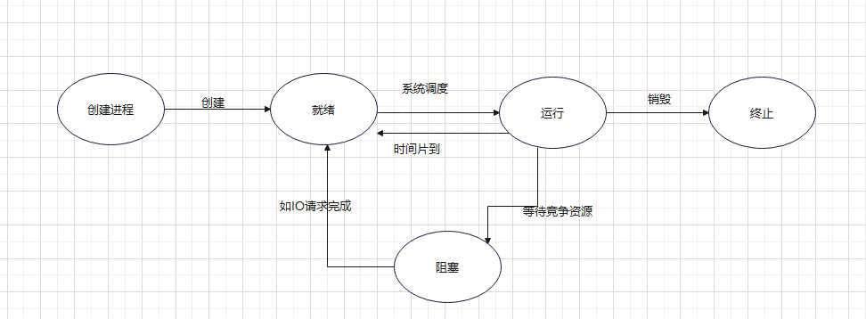

引起进程状态转换的具体原因如下：

运行态→等待态：等待使用资源；如等待外设传输；等待人工干预。

等待态→就绪态：资源得到满足；如外设传输结束；人工干预完成。

运行态→就绪态：运行时间片到；出现有更高优先权进程。

就绪态—→运行态：CPU 空闲时选择一个就绪进程

# **1.3进程控制块**

进程控制块就是用于保存一个进程信息的结构体，又称之为PCB 

OS是根据PCB来对并发执行的进程进行控制和管理的。系统在创建一个进程的时候会开辟 

一段内存空间存放与此进程相关的PCB数据结构。 

PCB是操作系统中最重要的记录型数据结构。PCB中记录了用于描述进程进展情况及控制进 

程运行所需的全部信息。 

PCB是进程存在的唯一标志，在Linux中PCB存放在task_struct结构体中。

/usr/src

$ sudo apt-get install ctags

sudo ctags -R

查看结构体  vim -t task_struct

调度数据 (进程的状态,标记优先级,调度策略等)

时间数据: 创建该进程的时间,在用户态的运行时间,在内核态的运行时间.

文件数据： 文件描述符表,内存数据,进程标识(进程号)

# 二.**进程控制**

# 2.1**进程号**

每个进程都由一个进程号来标识，其类型为pid_t，进程号的范围：0～32767 

进程号是由操作系统随机给当前进程分配的，不能自己控制 

进程号总是唯一的，但进程号可以重用。当一个进程终止后，其进程号就可以再次使用了

在ubuntu中查看当前系统中所有的开启的进程

~~~linux
ps -ajx
~~~

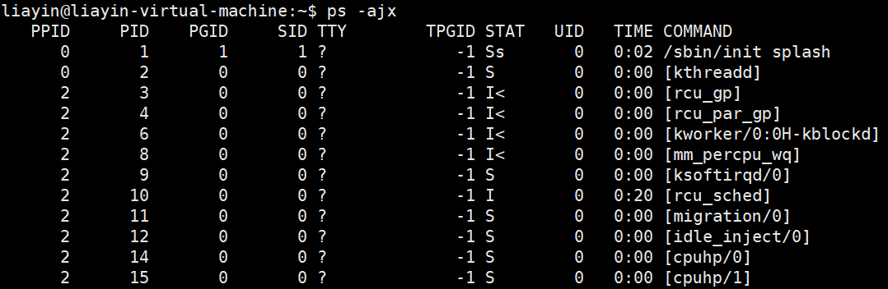

PPID：当前进程的父进程的进程号 

PID：当前进程的进程号 

PGID：当前进程所在的组的进程组ID 

COMMAND：当前进程的名字 

**特殊的进程号：** 

​     在linux系统中进程号由0开始。 

​     进程号为0及1的进程由内核创建。 

​     进程号为0的进程通常是调度进程，常被称为交换进程(swapper)。 

​     进程号为1的进程通常是init进程，init进程是所有进程的祖先。 

​     除调度进程外，在linux下面所有的进程都由进程init进程直接或者间接创建。 

**进程号(PID)** 

​      标识进程的一个非负整型数。 

**父进程号(PPID)** 

​     任何进程(除init进程)都是由另一个进程创建，该进程称为被创建进程的父进程，对应 

​      的进程号称为父进程号(PPID)。 

**进程组号(PGID)**

进程组是一个或多个进程的集合。他们之间相互关联，进程组可以接收同一终端的各种 

信号，关联的进程有一个进程组号(PGID) 。 

**Linux操作系统提供了三个获得进程号的函数getpid()、getppid()、getpgid()**

~~~Linux
man getpid    man getpgid
~~~

~~~Linux
1 #include <sys/types.h>
2 #include <unistd.h>
3 pid_t getpid(void);
4 功能：获取当前进程的进程号
5 pid_t getppid(void);
6 功能：获取当前进程的父进程的进程号
7 pid_t getpgid(pid_t pid);
8 功能：获取当前进程所在进程组的id
~~~

~~~c
#include <stdio.h>
 #include <sys/types.h>
 #include <unistd.h>

 int main(int argc, char const *argv[])
{
 //获取当前进程的进程号
 printf("pid = %d\n", getpid());

 //获取当前进程的父进程的id
 printf("ppid = %d\n", getppid());

 //获取当前进程所在组的id
 printf("pgid = %d\n", getpgid(getpid()));

 while(1)
 {

  } 
  return 0;
}
~~~


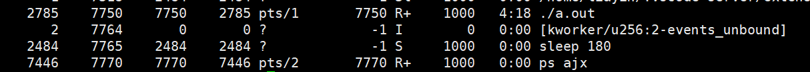

## 2.2进程的创建fork函数

~~~c
  #include <sys/types.h>
  #include <unistd.h>
  pid_t fork(void);
  功能: 在已有的进程基础上创建一个子进程.
  参数无
  返回值:
  成功:
   >0 子进程的进程号,标识父进程的代码区
   0  子进程的代码区
  失败:
    -1  返回给父进程,子进程不会创建.
   

~~~

使用fork函数得到的子进程是父进程的一个复制品,它从父进程处继承了整个进程的地址空间

地址空间: 

   包括进程上下文,进程堆栈,打开的文件描述,信号控制设定,进程优先级,进程组号等.

子进程所独有的只有它的进程号,计时器,因此,使用fork函数的代价是很大的.

  **fork函数执行完毕后父子进程的空间示意图：**

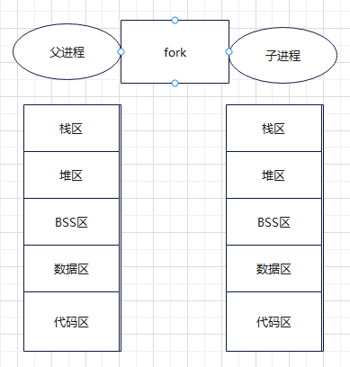


## 2.2.1创建子进程

### 1.创建子进程

~~~c
#include <stdio.h>
#include <stdlib.h>
#include <unistd.h>
int main(){
	//执行一次fork，就会在原有的进程基础上创建一个新的子进程
	//而且如果fork之后不区分父子进程的代码区，则后面所有的代码都会执行
	//fflush(stdout);
	fork();
	printf("hello world");
   // fflush(NULL);
	while(1){

    }
}
~~~

### 2.创建区分主进程与子进程

~~~c
#include <stdio.h>
#include <stdlib.h>
#include <sys/types.h>
#include <unistd.h>
int main(){
   
    pid_t pid;
    printf("[%d]:Begin!\n",getpid());    //一定是父进程打印的
     //fflush(NULL);
    pid=fork();
    if(pid<0){
        perror("fork创建进程错误!");
        exit(1);
    }
    if(pid==0){
        printf("[%d]:子进程正在工作...\n",getpid());
    }else{
        sleep(1);
        printf("[%d]:父进程正在工作...\n",getpid());
    }
     printf("[%d]End!\n",getpid());
   //  getchar();
    exit(0);
}


#include <stdio.h>
#include <stdlib.h>
#include <sys/types.h>
#include <unistd.h>
int main(){
     
     pid_t pid;
     pid=fork();
     if(pid <0){
        perror("fail to fork...");
        exit(1);
     }
     if(pid ==0){
        //子进程代码区
        printf("[%d]子进程正在运行中....\n",getpid());
        for(int i=0;i<100;i++){
            printf("子进程i=====%d\n",i);
        }
     }else{
        //父进程代码区
        printf("[%d]父进程正在运行中....\n",getpid());
        for(int k=0;k<100;k++){
            printf("父进程k=====%d\n",k);
        }
     }
     while(1);
    return 0;
}

~~~

ps axf   查看进程关系如图所示:

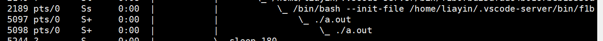

./a.out    >  /home/liayin/temp/out  

  注意begin! 为什么打印两次?

  加\n 不能解决问题,   标准IO输入输出流   遇到\n刷新缓冲区

 \n对文件流不起作用, 应该在fork之前加上fflush(NULL),刷新所有的流.

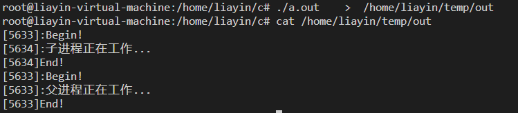

### 3.父进程拥有独立的地址空间.

~~~c
#include <stdio.h>
#include <stdlib.h>
#include <unistd.h>
int x=10;
int main(){
     static int y=10;
     int z=10;
     pid_t pid;
     pid=fork();
     if(pid<0){
        perror("创建进程失败");
        return -1;
     }
     if(pid>0){
        //父进程的代码区
        printf("父进程....\n");
        x++;
        y++;
        z++;
        printf("x=%d, y=%d, z=%d\n",x,y,z);
     }else{
        //子进程的代码区
         sleep(1);
         printf("子进程...\n");
         printf("x=%d, y=%d, z=%d\n",x,y,z);
     }
    
     while(10){

     }
    return 0;

}
~~~

执行结果:

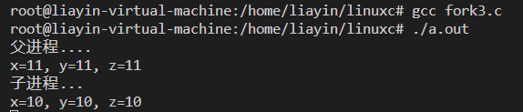

### 4.子进程继承父进程的空间,

   子进程会继承父进程的一些公有的区域,比如磁盘空间,内核空间,

 //文件描述符的偏移量保存在内核空间中,所以父进程改变偏移量,则子进程获取的偏移量是改变之后的.所以子进程继承父进程的空间.

~~~c
#include <stdio.h>
#include <stdlib.h>
#include <unistd.h>
#include <sys/types.h>
#include <sys/stat.h>
#include <fcntl.h>
int main(){
    int fd;
    if((fd=open("myfile.txt",O_RDONLY))==-1){
        perror("open file fail...");
        return -1;
    }
    pid_t pid;
    pid=fork();
    if(pid<0){
        perror("fork fail....");
        return -1;
    }
    if(pid >0 ){
        printf("父进程....\n");
        char buffer[32]="";
        if(read(fd,buffer,20) == -1){
            perror("read file fail...");
            return -1;
        }
        printf("buffer=[%s]\n",buffer);
    }else{
         printf("子进程....\n");
        char buffer[32]="";
        if(read(fd,buffer,20) == -1){
            perror("read file fail...");
            return -1;
        }
        printf("buffer=[%s]\n",buffer);
    }
    while(10){

    
    }
    return 0;
}
~~~

运行效果图:

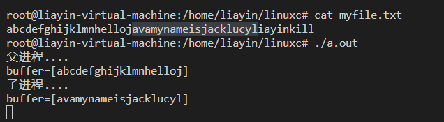

### 5.进程sleep 睡眠状态

 sleep函数

~~~c
1 #include <unistd.h>
2 unsigned int sleep(unsigned int seconds);
3 功能：进程在一定的时间内没有任何动作，称为进程的挂起（进程处于等待态）
4 参数：
5 seconds：指定要挂起的秒数
6 返回值：
7 若进程挂起到second指定的时间则返回0，若有信号中断则返回剩余秒数
8 注意：
9 进程挂起指定的秒数后程序并不会立即执行，系统只是将此进程切换到就绪态
~~~

~~~c
#include <stdio.h>
#include <unistd.h>

int main()
{
    while(1)
    {
        printf("hello\n");
        //当运行到sleep函数后，程序会在此位置等待设定的秒数，当秒数到达后，代码会接着执行
        //sleep运行时进程为等待态，时间到达后会先切换到就绪态，如果代码继续运行，再切换到运行态
        sleep(1);
    }
    
    return 0;
}
~~~

### **6.子进程的等待wait函数**

~~~c
 #include <sys/types.h>
2 #include <sys/wait.h>
3 pid_t wait(int *status);
4 功能：等待子进程终止，如果子进程终止了，此函数会回收子进程的资源。
5 调用wait函数的进程会挂起，直到它的一个子进程退出或收到一个不能被忽视的信号时才
被唤醒。
6 若调用进程没有子进程或它的子进程已经结束，该函数立即返回。
7 参数：
8 status：函数返回时，参数status中包含子进程退出时的状态信息。
9 子进程的退出信息在一个int中包含了多个字段，
10 用宏定义可以取出其中的每个字段
11 子进程可以通过exit或者_exit函数发送退出状态
12 返回值：
13 成功：子进程的进程号。
14 失败：‐1
~~~

取出子进程的退出信息 

**WIFEXITED(status)** 

如果子进程是正常终止的，取出的字段值非零。 

**WEXITSTATUS(status)** 

返回子进程的退出状态，退出状态保存在status变量的8~16位。 

在用此宏前应先用宏WIFEXITED判断子进程是否正常退出，正常退出才可以使用此 

宏。 

注意： 

此status是个wait的参数指向的整型变量。 

~~~
#include <stdio.h>
#include <stdlib.h>
#include <unistd.h>
#include <sys/types.h>
#include <sys/wait.h>

int main()
{
	pid_t pid;
	pid=fork();
	if(pid<0)
	{
		perror("进程创建失败");
        return -1;
    }
	if(pid == 0)
	{
		int i = 0;
		for(i=0;i<3;i++)
		{
			printf("子进程\n");
			sleep(1);
		}
		//使用exit退出当前进程并设置退出状态
		exit(3);
	}
	else 
	{
		//使用wait在父进程中阻塞等待子进程的退出
		//不接收子进程的退出状态
		//wait(NULL);
		//接收子进程的退出状态，子进程中必须使用exit或者_exit函数退出进程是发送退出状态
		int status = 0;
		wait(&status);
		if(WIFEXITED(status) != 0)
		{
			printf("子进程返回状态: %d\n", WEXITSTATUS(status));
		}
		printf("父进程\n");	
	}

	return 0;
}
~~~

### **7.waitpid函数**

~~~c
1 #include <sys/types.h>
2 #include <sys/wait.h>
3 pid_t waitpid(pid_t pid, int *status,int options)
4 功能：等待子进程终止，如果子进程终止了，此函数会回收子进程的资源。
5 参数：
6 pid：指定的进程或者进程组
7 pid>0：等待进程ID等于pid的子进程。
8 pid=0：等待同一个进程组中的任何子进程，如果子进程已经加入了别的进程组，waitpid不会等待它。
9 pid=‐1：等待任一子进程，此时waitpid和wait作用一样。
10 pid<‐1：等待指定进程组中的任何子进程，这个进程组的ID等于pid的绝对值
    
11 status：保存子进程退出时的状态信息
    
12 options：选项
13 0：同wait，阻塞父进程，等待子进程退出。
14 WNOHANG：如果没有可用的子进程退出状态，则返回0。
15 WUNTRACED：如果子进程暂停了则此函数马上返回，并且不予以理会子进程的结束状态。（跟踪调试，很少用到）
    
16 返回值：
17 成功：返回状态改变了的子进程的进程号；如果设置了选项WNOHANG并且pid指定的进程存在则返回0。
18 失败：返回‐1。当pid所指示的子进程不存在，或此进程存在，但不是调用进程的子进程，waitpid就会出错返回，这时errno被设置为ECHILD。
    
19 wait(status) <==> waitpid(‐1, status, 0)
~~~

~~~c
#include <stdio.h>
#include <stdlib.h>
#include <unistd.h>
#include <sys/types.h>
#include <sys/wait.h>

int main(int argc, char *argv[])
{
	pid_t pid;
	
	pid=fork();
	if(pid < 0)
    {
		perror("创建进程失败");
        return -1;
    }
	if(pid == 0)
	{
		int i = 0;
		for(i=0;i<5;i++)
		{
			printf("子进程\n");
			sleep(1);
		}
		exit(0);
	}
	else 
	{		
		waitpid(pid, NULL, 0);
		printf("父进程\n");	
	}
	return 0;
}
~~~

僵尸进程 :进程已经结束,但进程的占用的资源未被回收,这样的进程称为僵尸进程.

​           子进程已经运行结束,父进程未调用wait或waitpid函数回收子进程的资源使子进程变为僵尸进程的原因.

孤儿进程:

​      父进程运行结束,但子进程未运行结束的子进程.

守护进程:

   守护进程是个特殊的孤儿进程,这种进程脱离终端,在后台运行.


### **8.进程的终止exit函数**

~~~c
1 #include <unistd.h>
2 void exit(int status);
3 功能：退出当前进程
4 参数：
5 status：退出状态，由父进程通过wait函数接收这个状态
6 一般失败退出设置为非0
7 一般成功退出设置为0
8 返回值：
9 无
~~~

 

**_exit函数** 

~~~c
 #include <stdlib.h>
2 void _exit(int status);
3 功能：退出当前进程
4 参数：
5 status：退出状态，由父进程通过wait函数接收这个状态
6 一般失败退出设置为非0
7 一般成功退出设置为0
8 返回值：
9 无
~~~

exit和_exit函数的区别： 

exit为库函数，而_exit为系统调用 

exit会刷新缓冲区，但是_exit不会刷新缓冲区 

一般会使用exit  


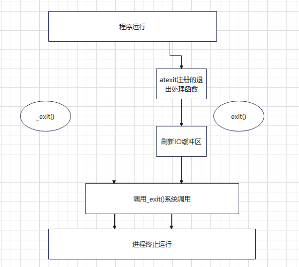

~~~c
#include <stdio.h>
#include <unistd.h>
#include <stdlib.h>
void fun(){
    printf("BBB\n");
    return;
    printf("CCC\n");
}
int main(){

   printf("AAA\n");
   fun();
   printf("DDD\n");
   return 0;

}

~~~

return 除了返回值以外,在主函数中可以退出进程,但是在子函数中使用只能退出当前函数.

exit(0) 可以退出一个进程,且可以刷新缓冲区.

_exit(0) 可以退出一个进程,但是不会刷新缓冲区.

### **9.进程退出清理**

~~~c
#include <stdlib.h>
 int atexit(void (*function)(void));
功能: 注册进程正常结束前调用的函数,进程退出执行注册函数.
参数: function: 进程结束前,调用函数的入口地址.
    一个进程中可以多次调用atexit函数注册清理函数.
    正常结束前调用函数的顺序和注册时的顺序相反.以入栈出栈的形式调用。
返回值:
   成功: 0
   失败: 非0
~~~

~~~c
#include <stdio.h>
#include <stdlib.h>
#include <unistd.h>
void fun1(){
    printf("clear fun1...\n");
}
void fun2(){
    printf("clear fun2...\n");
}
void fun3(){
    printf("clear fun3...\n");
}
int main(){
    //atexit函数在进程结束时,才会去执行参数对应的回调函数.
    atexit(fun1);
    atexit(fun2);
    atexit(fun3);
    printf("*****************\n");
    sleep(3);
    /*
    while(1){

    }
    */
    return 0;
}
~~~

### **10.进程的创建--vfork函数**

~~~c
 #include <sys/types.h>
 #include <unistd.h>
 pid_t vfork(void);
 功能:vfork函数和fork函数一样都是在已有的进程中创建一个新的进程,但是它们创建的子进程是有区别的.
 参数: 无
 返回值:
   成功:  子进程中返回0, 父进程中返回子进程ID
   失败:  -1
~~~

fork与vfork函数的区别:

vfork保证子进程先运行,在它调用exec或 exit之后,父进程才可能被调度运行.

~~~c
#include <stdio.h>
#include <stdlib.h>
#include <unistd.h>
int main(){

     pid_t pid;
     //使用vfork函数创建子进程
     pid=vfork();
     if(pid<0){
        perror("子进程创建失败...");
        exit(1);
     }
     if(pid==0){
         int i=0;
         for(i=0;i<6;i++){
            printf("子进程在运行中...\n");
            sleep(1);
         }
         exit(0);

     }else{
         //父进程代码区
         while(10){
            printf("父进程运行中....\n");
            sleep(1);
         }
     }
     return 0;

}
~~~

### **11.子进程和父进程共享同一块空间(=vfork创建)**

~~~c
#include <stdio.h>
#include <stdlib.h>
#include <unistd.h>
int x=10;
int main(){
     static int y=10;
     int z=10;
     pid_t pid;
     pid=fork();
     if(pid<0){
        perror("创建进程失败");
        return -1;
     }
     if(pid>0){
        //父进程的代码区
        printf("父进程....\n");
        x++;
        y++;
        z++;
        printf("x=%d, y=%d, z=%d\n",x,y,z);
     }else{
        //子进程的代码区
         sleep(1);
         printf("子进程...\n");
         printf("x=%d, y=%d, z=%d\n",x,y,z);
     }
    
     while(10){

     }
    return 0;

}

vfork


#include <stdio.h>
#include <stdlib.h>
#include <sys/types.h>
#include <unistd.h>
int x=100;
int main(){
     static int y=200;
     int z=300;
     pid_t pid;
     //在vfork下空间内容相互影响
     pid=vfork();
     if(pid<0){
        perror("创建进程失败!");
        return -1;
     }
     if(pid>0){
        //父进程的代码区
        printf("父进程正在运行中...\n");
      
        printf("x==%d,y==%d,z==%d\n",x,y,z);
     }else{
        //子进程的代码区
       
         printf("子进程正在运行中...\n");
           x++;
           y++;
           z++;
        
        printf("x==%d,y==%d,z==%d\n",x,y,z);
        exit(0);
     }
    while(1);
    return 0;
}
~~~


### **12.exec进程的替换**

 进程的替换 

exec函数族，是由六个exec函数组成的。 

1、exec函数族提供了六种在进程中启动另一个程序的方法。 

2、exec函数族可以根据指定的文件名或目录名找到可执行文件。 

3、调用exec函数的进程并不创建新的进程，故调用exec前后，进程的进程号并不会改变，其执行的程序完全由新的程序替换，而新程序则从其main函数开始执行。 

exec函数族取代调用进程的数据段、代码段和堆栈段

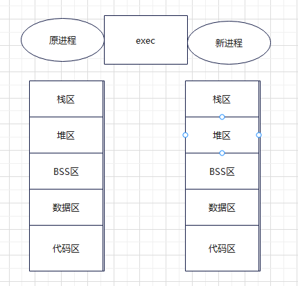

一个进程调用exec后，除了进程ID，进程还保留了下列特征不变： 

父进程号 

进程组号 

控制终端 

根目录 

当前工作目录 

进程信号屏蔽集 

未处理信号 

~~~c
1 exec函数族
2 #include <unistd.h>
3 int execl(const char *path, const char *arg, .../* (char *) NULL */);
4 int execlp(const char *file, const char *arg, .../* (char *) NULL */);
5 int execv(const char *path, char *const argv[]);
6 int execvp(const char *file, char *const argv[]);
7 int execle(const char *path, const char *arg, .../*, (char *) NULL*/, char * const envp[] );
8 int execvpe(const char *file, char *const argv[], char *const envp[]);
9 功能：在一个进程里面执行另一个程序，主要用于执行命令
10 参数：
11 path：命令或者程序的路径
12 l：
    如果是带l的函数，对应的命令或者程序是通过每一个参数进行传递的，最后一个为NULL表示结束
    "ls", "‐l", NULL
15 v:
	如果是带v的函数，对应的命令或者程序是通过一个指针数组来传递的，指针数组的最后一个元素为NULL标识结束
	char *str[] = {"ls", "‐l", NULL};
18 p：
    如果不带p的函数，第一个参数必须传当前命令或者程序的绝对路径，
	如果是带p的函数，第一个参数既可以是绝对路径，也可以是相对路径
20 返回值：
21 失败：‐1
~~~

~~~
例子1.
 //调用exec函数族中的函数，执行其他命令或者程序
 //查看命令的路径：whereis 命令或者which 命令
 //***************exec函数族调用shell命令******************
 //不带p的函数，命令的路径一定要用绝对路径

#include <stdio.h>
#include <stdlib.h>
#include <unistd.h>
#include <sys/types.h>
#include <sys/wait.h>

int main(int argc, char const *argv[])
{
    pid_t pid;
    if((pid = fork()) < 0)
    {
        perror("fail to fork");
        exit(1);
    }
    else if(pid > 0) //父进程
    {
        printf("父进程在运行中\n");

        wait(NULL);
        printf("子进程运行结束\n");
    }
    else //子进程
    {
        printf("子进程运行中\n");

          if(execl("/bin/ls", "ls", "-l", NULL) == -1)
        {
            perror("fail to execl");
            exit(1);
        }

        printf("hello\n");
    }

    return 0;
}
第二种方式:
 //带p的函数，第一个参数既可以是相对路径，也可以是绝对路径

 if(execlp("ls", "ls", "-l", NULL) == -1)
        {
            perror("fail to execlp");
            exit(1);
        }
第三种方式:
//带v的函数需要使用指针数组来传递
    char *str[] = {"ls", "-l", NULL};
    if(execv("/bin/ls", str) == -1)
     {
         perror("fail to execv");
         exit(1);
     }
 第四种方式:
    //***************exec函数族调用可执行文件******************     
        if(execlp("./hello", "./hello", NULL) == -1)
        {
            perror("fail to execlp");
            exit(1);
        }
第五种方式:
    if(execl("./hello", "./hello", NULL) == -1)
        {
            perror("fail to execl");
            exit(1);
        }
第六种方式:
   //***************exec函数族调用shell脚本******************       
        if(execlp("./myshell.sh", "./myshell.sh", NULL) == -1)
        {
            perror("fail to execl");
            exit(1);
        }


~~~

### **13.system函数**

~~~c
#include <stdlib.h>
2 int system(const char *command);
3 功能：执行一个shell命令（shell命令、可执行文件、shell脚本）
4 system会调用fork函数产生子进程，
5 子进程调用exec启动/bin/sh ‐c string
6 来执行参数string字符串所代表的命令，此命令执行完后返回原调用进程
8 参数：
9 command：要执行的命令的字符串
10 返回值：
11 如果command为NULL，则system()函数返回非0，一般为1。
12 如果system()在调用/bin/sh时失败则返回127，其它失败原因返回‐1
~~~

~~~
#include <stdio.h>
#include <stdlib.h>

int main(int argc, char const *argv[])
{
    //使用system执行shell命令
    system("clear");

    system("ls -l");

    system("./myhello");


    return 0;
}
~~~

# 三.信号

## **3.1进程间通信概述**

进程间通信(IPC:Inter Processes Communication)进程是一个独立的资源分配单元，不同进程（这里所说的进程通常指的是用户进程）之 

间的资源是独立的，没有关联，不能在一个进程中直接访问另一个进程的资源（例如打开的文件描述符）。 

进程不是孤立的，不同的进程需要进行信息的交互和状态的传递等，因此需要进程间通 信。 

进程间通信功能： 

数据传输：一个进程需要将它的数据发送给另一个进程。 

资源共享：多个进程之间共享同样的资源。 

通知事件：一个进程需要向另一个或一组进程发送消息，通知它们发生了某种事件。 

进程控制：有些进程希望完全控制另一个进程的执行（如Debug进程），此时控制进程 

希望能够拦截另一个进程的所有操作，并能够及时知道它的状态改变。

Linux操作系统支持的主要进程间通信的通信机制

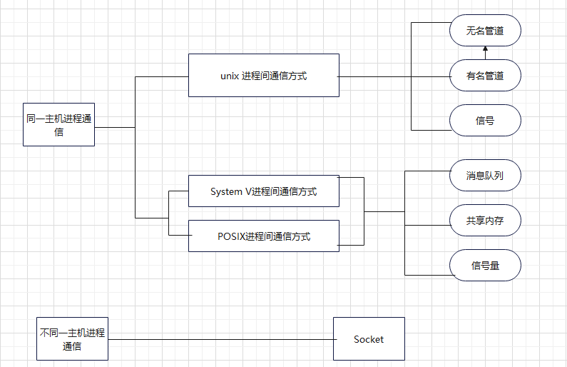

**进程间通信的实质：** 

系统只要创建一个进程，就会给当前进程分配4G的虚拟内存（32位操作系统），虚拟内存 不是常说的内存条的空间，内存条的空间称之为物理内存，虚拟内存和物理内存之间存在映射关系 

4G的虚拟内存分为3G的用户空间（0~3G）和1G（3~4G）的内核空间， 

用户空间是进程所私有的，每一个进程的用户空间只能自己访问和使用，我们之前说的栈区、堆区、数据区、代码区等都是用户空间的区域内核空间是所有进程所公有的，也就意味着绝大多数进程间通信方式，本质就是对内核空间的操作 

**特殊的进程间通信方式：** 

socket通信可以实现不同主机的进程间通信，其他六个只能在一台主机的多个进程间通信 

信号通信是唯一的一种异步通信机制 

共享内存是所有进程间通信方式中效率最高的，他是直接对物理内存进行操作 

## **3.2信号的概述** 

### **3.2.1 信号的概念** 

信号是软件中断，它是在软件层次上对中断机制的一种模拟。 

信号可以导致一个正在运行的进程被另一个正在运行的异步进程中断，转而处理某一个突发事件。 

信号是一种异步通信方式。 

进程不必等待信号的到达，进程也不知道信号什么时候到达。 

信号可以直接进行用户空间进程和内核空间进程的交互，内核进程可以利用它来通知用户空间进程发生了哪些系统事件。 

每个信号的名字都以字符SIG开头。 

每个信号和一个数字编码相对应，在头文件signum.h中，这些信号都被定义为正整数。 

信号名定义路径：

/usr/include/x86_64-linux-gnu/bits /signum.h 

在Linux下，要想查看这些信号和编码的对应关系，可使用命令：kill ­-l

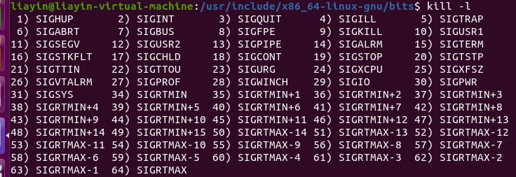

信号是由当前系统已经定义好的一些标识，每一个标识都会在特定的场合使用并且都会对进程有一定的影响，当信号产生时，会让当前信号做出相应的操作。这些信号都是已经定义好的，我们不能自己再去创造，直接使用这些就可以

### **3.2.2 产生信号的方式** 

1、当用户按某些终端键时，将产生信号 

例如：终端上按“Ctrl+c”组合键通常产生中断信号SIGINT、 

终端上按"Ctrl+\ "键通常产生中断信号SIGQUIT、 

终端上按"Ctrl+z"键通常产生中断信号SIGTSTP。 

2、硬件异常将产生信号 

除数为0，无效的内存访问等。这些情况通常由硬件检测到，并通知内核,然后内核产生适当的信号发送给相应的进程。 

3、软件异常将产生信号。 

当检测到某种软件条件已发生，并将其通知有关进程时，产生信号。 

4、调用kill函数将发送信号。 

注意：接收信号进程和发送信号进程的所有者必须相同，或发送信号进程的所有者必须是超级用户。 

5、运行kill命令将发送信号。 

此程序实际上是使用kill函数来发送信号。也常用此命令终止一个失控的后台进程。 

### **3.2.3 信号的默认（缺省）处理方式** 

当进程中产生了一个信号，就会让当前进程做出一定的反应， 

默认处理进程的方式如下 

1、终止进程：当信号产生后，当前进程就会立即结束 

2、缺省处理：当信号产生后，当前进程不做任何处理 

3、停止进程：当信号产生后，使得当前进程停止 

4、让停止的进程恢复运行：当信号产生后，停止的进程会恢复执行（后台进程）

注意：每一个信号只有一个默认的处理方式 

### **3.2.4 进程接收到信号后的处理方式** 

**1、执行系统默认动作** 

对大多数信号来说，系统默认动作是用来终止该进程。 

**2、忽略此信号** 

接收到此信号后没有任何动作。 

**3、执行自定义信号处理函数** 

用用户定义的信号处理函数处理该信号。

| 信号    | 值   | 性质                                                         | 默认处理方式       |
| ------- | ---- | ------------------------------------------------------------ | ------------------ |
| SIGKILL | 9    | 当产生这个信号后，当前进程会退出，                           | 退出进程           |
| SIGSTOP | 19   | 当产生这个信号后，当前进程会停止，不能被缺省和捕捉           | 停止进程           |
| SIGINT  | 2    | 键盘输入ctrl+c时产生信号                                     | 退出进程           |
| SIGQUIT | 3    | 键盘输入ctrl+\时产生信号                                     | 退出进程           |
| SIGTSTP | 20   | 键盘输入ctrl+z时产生信号                                     | 停止进程           |
| SIGCONT | 18   | 当产生当前信号后，当前停止的进程会恢复运行                   | 停止的进程恢复运行 |
| SIGALRM | 14   | 当调用alarm函数设置的时间到达时会产生当前信号                | 退出进程           |
| SIGPIPE | 13   | 当管道破裂时，会产生当前信号                                 | 退出进程           |
| SIGABRT | 6    | 当调用abort函数时会产生当前信号                              | 退出进程           |
| SIGCHLD | 17   | 当使用fork创建一个子进程时，如果子进程状态改变（退出），会产生当前信号 | 缺省               |
| SIGUSR1 | 10   | 用户自定义信号，不会自动产生，只能使用kill函数或者命令给指定的进程发送当前信号 | 缺省               |
| SIGUSR2 | 12   | 用户自定义信号，不会自动产生，只能使用kill函数或者命令给指定的进程发送当前信号 | 缺省               |

### **3.3kill函数**（发送信号）

~~~c
1 #include <sys/types.h>
2 #include <signal.h>
3 int kill(pid_t pid, int sig);
4 功能：给指定的进程或者进程组发送信号
5 参数：
6 pid：
7 pid>0: 将信号传送给进程ID为pid的进程。
8 pid=0: 将信号传送给当前进程所在进程组中的所有进程。
9 pid=‐1: 将信号传送给系统内所有的进程，除了init进程
10 pid<‐1: 将信号传给指定进程组的所有进程。这个进程组号等于pid的绝对值。
11 sig：指定的信号
12 返回值：
13 成功：0
14 失败：‐1
~~~


~~~c
#include <stdio.h>
#include <stdlib.h>
#include <unistd.h>
#include <signal.h>
#include <sys/types.h>

int main(int argc, char *argv[])
{
    pid_t pid;

    pid = fork();
    if(pid < 0)
    {
        perror("fail to fork");
        exit(1);
    }
    else if(pid > 0) //父进程的代码区
    {
        while(1)
        {
            printf("父进程\n");

            sleep(1);
        }
    }
    else //子进程的代码区 
    {
        printf("子进程\n");

        //子进程在3秒之后，让父进程退出
        sleep(3);

        //使用kill给父进程发送信号，然后父进程接收到信号后直接退出就可以了
        kill(getppid(), SIGINT);
    }
	return 0;
}
~~~

### **3.4alarm函数**（产生定时信号）

~~~c
#include <unistd.h>
  unsigned int alarm(unsigned int seconds);
功能: 定时器,闹钟,当设定的时间到时,会产生SIGALRM信号
参数  second设定的秒数
返回值  
  如果alarm函数之前没有alarm设置,则返回0
  如果有,则返回上一个alarm剩余的时间.
    
~~~

~~~c
#include <stdio.h>
#include <unistd.h>
int main(){

   unsigned int second;
    second=alarm(5);
    sleep(3);
    second=alarm(7);

    printf("second= %d\n",second);
    while(10){
        printf("AAAAAAA\n");
        sleep(1);
    }
}
~~~

### **3.5raise 函数**（给自己发信号）

~~~c
  #include <signal.h>
    int raise(int sig);
  功能: 给调用进程本身发送信号。
  参数: sig 指定的信号
  返回值:
      成功:  0
      失败:  非0
~~~

~~~c
 #include <stdio.h>
 #include <stdlib.h>
 #include <unistd.h>
 #include <sys/types.h>
  #include <signal.h>
  int main(){
           int count=0;
          while(1){
             printf("aaaa\n");
             sleep(1);
             count++;
             if(count==5){
                //raise(SIGINT);
                raise(SIGALRM);
             }
          }
  }
~~~

### **3.6 pause函数**（阻塞等待信号）

~~~c
1 #include <unistd.h>
2 int pause(void);
3 功能：阻塞等待一个信号的产生/判断信号是否已经到达
4 参数：
5 无
6 返回值：
7 当有信号产生时，函数返回‐1
~~~

~~~c
#include <stdio.h>
#include <stdlib.h>
#include <unistd.h>
#include <signal.h>
#include <sys/types.h>

int main(int argc, char *argv[])
{
    pid_t pid;

    pid = fork();
    if(pid < 0)
    {
        perror("进程创建失败");
        exit(1);
    }
    else if(pid > 0) //父进程的代码区
    {
        printf("父进程在运行中...\n");

        //使用pause阻塞等待捕捉信号
        pause();
        
    }
    else //子进程的代码区 
    {
        printf("子进程在运行中...\n");

        sleep(3);

        kill(getppid(), SIGINT);
    }

	return 0;
}


~~~

### 3.7signal 函数（收到信号后处理信号）

~~~c
 #include <signal.h>
  typedef void (*sighandler_t)(int);
sighandler_t signal(int signum, sighandler_t handler);
功能: 当进程中产生某个信号时,对当前信号进行处理.
参数:
   sig :指定要处理的信号
   handler :处理方式
   SIG_IGN: 当信号产生时,以缺省(忽略)的方式处理
   SIG_DFL: 当信号产生时,以当前信号默认的方式处理.
    void handler(int sig) :当信号产生时,通过信号处理函数自定义方式处理,函数名可以随便写.
       参数 表示当前的信号
   返回值: 
    成功: 返回函数的地址,该地址为此信号上一次注册的信号处理函数的地址.
    失败: SIG_ERR
~~~

#### 3.7.1signal函数的使用

~~~c
#include <stdio.h>
#include <signal.h>
#include <unistd.h>
#include <stdlib.h>
void handler(int sig);
int main(){
    //以默认的方式处理信号
    #if 0
    if(signal(SIGINT,SIG_DFL)==SIG_ERR){
        perror("fail to signal");
        exit(1);
    }
     if(signal(SIGQUIT,SIG_DFL)==SIG_ERR){
        perror("fail to signal");
        exit(1);
    }
     if(signal(SIGTSTP,SIG_DFL)==SIG_ERR){
        perror("fail to signal");
        exit(1);
    }
    #endif
     //以忽略的方式来处理信号
     #if 0
     if(signal(SIGINT,SIG_IGN)==SIG_ERR){
        perror("fail to signal");
        exit(1);
    }
     if(signal(SIGQUIT,SIG_IGN)==SIG_ERR){
        perror("fail to signal");
        exit(1);
    }
     if(signal(SIGTSTP,SIG_IGN)==SIG_ERR){
        perror("fail to signal");
        exit(1);
    }
   #endif 
    //以用户自定义方式处理信号
        if(signal(SIGINT,handler)==SIG_ERR){
        perror("fail to signal");
        exit(1);
    }
    if(signal(SIGQUIT,handler)==SIG_ERR){
        perror("fail to signal");
        exit(1);
    }
     if(signal(SIGTSTP,handler)==SIG_ERR){
        perror("fail to signal");
        exit(1);
    }
    /*  SIGKILL与SIGSTOP这两个信号是不能忽略的方式处理,只能以默认的方式处理.
     if(signal(SIGKILL,SIG_IGN)==SIG_ERR){
        perror("fail to signal");
        exit(1);
    }
     if(signal(SIGSTOP,SIG_IGN)==SIG_ERR){
        perror("fail to signal");
        exit(1);
    }
    
    */
    while(1){
        printf("AAA\n");
        sleep(1);
    }
    return 0;
}
void handler(int sig){
    if(sig==SIGINT){
        printf("SIGINT正在处理!!!\n");
    }
     if(sig==SIGQUIT){
        printf("SIGQUIT正在处理!!!\n");
    }
     if(sig==SIGTSTP){
        printf("SIGTSTP正在处理!!!\n");
    }
}
~~~

#### 3.7.2signal函数的使用

~~~c
#include <stdio.h>
#include <signal.h>
#include <unistd.h>
#include <stdlib.h>

void *ret_handler;

void handler(int sig){
    printf("AAAAAAAAAA!\n");
    if(signal(SIGINT,ret_handler)==SIG_ERR){
        perror("fail to signal...");
        exit(1);
    }
}

int main(){
    
    if((ret_handler=signal(SIGINT,handler))==SIG_ERR){
        perror("fail to signal");
        exit(1);
    }
    while(1){
        printf("hello!\n");
        sleep(1);
    }
    return 0;
}

~~~

### 3.8. 可重入函数

可重入函数是指函数可以由多个任务并发使用,而不必担心数据错误.

可重入函数就可以被中断的函数,当前函数可在任何时刻中断它,并执行另一块代码,当执行完毕后,回到原来的代码还可以正常继续运行.

编写可重入函数:

 1.不使用静态的数据,全局变量(除非信号量互斥)

 2.不调用动态内存分配,释放的函数

 3.不调用任何不可重入的函数(标准的IO函数)

常见的可重入函数列表:

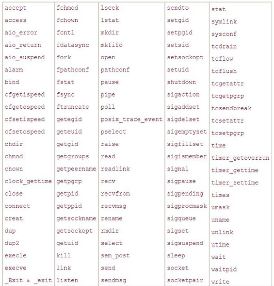


~~~c
#include <stdio.h>
#include <signal.h>
#include <unistd.h>
#include <stdlib.h>

void handler(int sig){
    printf("AAAAA\n");
}

int main(){

    signal(SIGINT,handler);
    //sleep是一个可重入函数,但是当执行信号处理函数之后,不会回到原来的位置继续睡眠.
   // sleep(6);
    alarm(10);
    while(1){
        printf("hello\n");
        sleep(1);
    }
}
~~~

~~~c
#include <stdio.h>
#include <signal.h>
#include <unistd.h>
#include <stdlib.h>

void handler(int sig){
    printf("AAAAA\n");
}

int main(){
    
    signal(SIGINT,handler);
     /*read也是可重入函数,在等待终端输入时,如果产生信号并执行信号处理函数,信号处理完之后,可以继续输入数据,*/
    char buffer[30]=" ";
    if(read(0,buffer,20)==-1){
        perror("fail to read");
        exit(1);
    }
    printf("buffer=[%s]\n",buffer);
    return 0;
}
~~~

### 3.9信号集

信号集是用来表示多个信号的数据类型.

sigemptyset

sigfillset

sigsmember

sigaddset

sigdelset

~~~c
      #include <signal.h>

       int sigemptyset(sigset_t *set);
       功能:初始化由set指向的信号集,清除其中所有的信号即初始化一个空集信号集.
       参数: set 信号集标识的地址,以后操作此信号集,对set进行操作就可以了.
       返回值:
          成功返回  0
          失败返回 -1

       int sigfillset(sigset_t *set);
       功能: 初始化信号集set,将信号集合设置为所有信号的集合.
       参数:   set 集号集标识的地址,以后操作此信号集,对set进行操作就可以了.
		   返回值:
          成功返回  0
          失败返回 -1
       int sigaddset(sigset_t *set, int signum);
        功能: 将信号signum 加入到信号集合 set之中.
        set : 信号集标识的地址.
        signum : 信号的编号
           返回值:
          成功返回  0
          失败返回 -1
       int sigdelset(sigset_t *set, int signum);
		   功能: 将信号signum 从信号集合 set中删除.
        set : 信号集标识的地址.
        signum : 信号的编号
           返回值:
          成功返回  0
          失败返回 -1
       int sigismember(const sigset_t *set, int signum);
          功能: 查询signum标识的信号是否在信号集合set之中.
           set : 信号集标识的地址.
           signum : 信号的编号
           返回值:
            成功返回  在信号集中返回1  不在信号集中返回0
            失败返回  返回-1
~~~


~~~c
#include <signal.h>
#include <stdio.h>
int main(){
    //创建一个信号集;
    sigset_t set;
    int ret=0;

    //初始化一个空的集号集;
    sigemptyset(&set);
    ret=sigismember(&set,SIGINT);
    if(ret == 0){
        printf("SIGINT不在信号集中%d\n",ret);
    }
    //添加指定的信号集
    sigaddset(&set,SIGINT);
    sigaddset(&set,SIGQUIT);
    ret=sigismember(&set,SIGINT);
    if(ret == 1){
        printf("SIGINT信号在信号集中....%d\n",ret);
    }
    return 0;
}
~~~

### 3.10 信号阻塞集

每个进程都有一个阻塞集,它用来描述哪些信号递送到该进程的时候被阻塞(在信号发生时记住它,直到进程准备好时再将信号通知进程)

所谓的阻塞并不是禁止传送信号,而是暂缓信号的传送.若将被阻塞的信号从信号阻塞集中删除,且对应的信号在被阻塞时发生了,进程会收到相应的信号.

~~~c
 int sigprocmask(int how, const sigset_t *set, sigset_t *oldset);
 功能:检查或修改信号阻塞集,根据how指定的方法对进程的阻塞集合进行修改,新的信号阻塞集由set指定,而原先的信号阻塞集合由oldset保存.
 参数:
    how : 信号阻塞集合的修改方法
    SIG_BLOCK :向信号阻塞集中添加set 信号集
    SIG_UNBLOCK: 从信号阻塞集合中删除set 集合
    SIG_SETMASK : 将信号阻塞集合设为set 集合
    set :  要操作的信号集地址
    oldset : 保存原先信号集地址:
    
    注意: 若set 为NULL,则不会改变信号阻塞集合,函数只把当前信号阻塞集合保存到oldset中.
    返回值:
    成功:  返回0
    失败:  返回-1
    
~~~


~~~c
#include <signal.h>
#include <stdio.h>
#include <stdlib.h>
#include <unistd.h>
int main(){

    sigset_t set;
    sigemptyset(&set);//初始化一个set
    sigaddset(&set,SIGINT);//给set放入一个SIGINT

    while(1){
        //将set信号集添加到信号阻塞集中
        sigprocmask(SIG_BLOCK,&set,NULL);
        for(int i=0;i<6;i++){
             printf("SIGINT 信号集在阻塞集中\n");
             sleep(1); 
        }
        //将set集号集从信号阻塞集中删除
        sigprocmask(SIG_UNBLOCK,&set,NULL);
          for(int i=0;i<6;i++){
             printf("SIGINT 信号集在阻塞集中删除\n");
             sleep(1); 
        }
        
    }

}
~~~

# 四、无名管道

### **4.1 无名管道概述** 

管道(pipe)又称无名管道。 

无名管道是一种特殊类型的文件，在应用层体现为两个打开的文件描述符。 

任何一个进程在创建的时候，系统都会 给他分配4G的虚拟内存，分为3G的用户空间和1G 的内核空间，内核空间是所有进程公有的，**无名管道就是创建在内核空间的**，多个进程知道同一个无名管道的空间，就可以利用他来进行通信

## 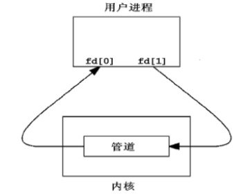

无名管道虽然是在内核空间创建的，但是会给当前用户进程两个文件描述符，一个负责执行读操作，一个负责执行写操作**管道是最古老的UNIX IPC方式，其特点是:** 

1、半双工，数据在同一时刻只能在一个方向上流动。 

2、数据只能从管道的一端写入，从另一端读出。 

3、写入管道中的数据遵循**先入先出**的规则。 

4、管道所传送的数据是无格式的，这要求管道的读出方与写入方必须事先约定好数据的格式，如多少字节算一个消息等。 

5、管道不是普通的文件，不属于某个文件系统，其只存在于内存中。 

6、管道在内存中对应一个缓冲区。不同的系统其大小不一定相同。 

7、从管道读数据是一次性操作，数据一旦被读走，它就从管道中被抛弃，释放空间以便写更多的数据。 

8、管道没有名字，只能在具有公共祖先的进程之间使用

### **4.2 无名管道的创建 -- pipe函数**

~~~c
1 #include <unistd.h>
2 int pipe(int pipefd[2]);
3 功能：创建一个无名管道，返回两个文件描述符负责对管道进行读写操作
4 参数：
5 pipefd：int型数组的首地址，里面有两个元素
6 pipefd[0] 负责对管道执行读操作
7 pipefd[1] 负责对管道执行写操作
8 返回值：
9 成功：0
10 失败：‐1
~~~

示例:

~~~c
#include <stdio.h>
#include <stdlib.h>
#include <unistd.h>
#include <string.h>

int main(int argc, char const *argv[])
{
    //使用pipe创建一个无名管道
    int fd_pipe[2];
    if(pipe(fd_pipe) == -1)
    {
        perror("fail to pipe");
        exit(1);
    }

    printf("fd_pipe[0] = %d\n", fd_pipe[0]);
    printf("fd_pipe[1] = %d\n", fd_pipe[1]);

    //对无名管道执行读写操作
    //由于无名管道给当前用户进程两个文件描述符，所以只要操作这两个文件描述符就可以操作无名管道，所以通过文件IO中的read和write函数对无名管道进行操作

    //通过write函数向无名管道中写入数据
    //fd_pipe[1]负责执行写操作
    //如果管道中有数据，再次写入的数据会放在之前数据的后面，不会把之前的数据替换
    if(write(fd_pipe[1], "I am a teacher", 14) == -1)
    {
        perror("fail to write");
        exit(1);
    }

    write(fd_pipe[1], "this is a book", strlen("this is a book")+1);

    //通过read函数从无名管道中读取数据
    //fd_pipe[0]负责执行读操作
    //读取数据时，直接从管道中读取指定个数的数据，如果管道中没有数据了，则read函数会阻塞等待
    char buf[32] = "";
    ssize_t bytes;
    if((bytes = read(fd_pipe[0], buf, 20)) == -1)
    {
        perror("fail to read");
        exit(1);
    }

    printf("buf = [%s]\n", buf);
    printf("bytes = %ld\n", bytes);
 
    bytes = read(fd_pipe[0], buf, sizeof(buf));
    printf("buf = [%s]\n", buf);
    printf("bytes = %ld\n", bytes);
   
    bytes = read(fd_pipe[0], buf, sizeof(buf));
    printf("buf = [%s]\n", buf);
    printf("bytes = %ld\n", bytes);

    return 0;
}

~~~

### **4.3 无名管道实现进程间通信**

~~~c
#include <stdio.h>
#include <stdlib.h>
#include <unistd.h>
#include <string.h>
int main(int argc, char const *argv[])
{
    //创建一个无名管道
    int pipefd[2];
    if(pipe(pipefd) == -1)
    {
        perror("fail to pipe");
        exit(1);
    }
    
    //使用fork函数创建子进程
    pid_t pid;
    if((pid = fork()) < 0)
    {
        perror("fail to fork");
        exit(1);
    }
    else if(pid > 0) // 父进程
    {
        //父进程负责给子进程发送数据 
        char buf[128] = {};
        while(1)
        {
            fgets(buf, sizeof(buf), stdin);
            buf[strlen(buf) - 1] = '\0';
            if(write(pipefd[1], buf, sizeof(buf)) == -1)
            {
                perror("fail to write");
                exit(1);
            }
        } 
    }
    else //子进程
    {
        //子进程接收父进程的数据
        char buf[128] = "";
        while(1)
        {
            if(read(pipefd[0], buf, sizeof(buf)) == -1)
            {
                perror("fail to read");
                exit(1);
            }

            printf("输出父进程写入管道的数据: %s\n", buf);
        }
    }

    return 0;
}
~~~

**注意：** 

利用无名管道实现进程间的通信，都是父进程创建无名管道，然后再创建子进程，子进程继承父进程的无名管道的文件描述符，然后父子进程通过读写无名管道实现通信

### **4.4 无名管道的读写规律**

#### **4.4.1 读写端都存在，只读不写**

~~~c
#include <stdio.h>
#include <stdlib.h>
#include <unistd.h>

int main(int argc, char const *argv[])
{
    int pipefd[2];
    if(pipe(pipefd) == -1)
    {
        perror("fail to pipe");
        exit(1);
    }

    write(pipefd[1], "hello world", 11);

    char buf[128] = "";
    if(read(pipefd[0], buf, sizeof(buf)) == -1)
    {
        perror("fail to read");
        exit(1);
    }

    printf("buf = %s\n", buf);

    if(read(pipefd[0], buf, sizeof(buf)) == -1)
    {
        perror("fail to read");
        exit(1);
    }

    printf("buf = %s\n", buf);

    return 0;
}
~~~

总结  读写端都存在，只读不写，如果管道中有数据，会正常读取数据；

​		  如果管道中没有数据，则读操作会阻塞等待，直到有数据为止

#### **4.4.2 读写端都存在，只写不读**

~~~c
#include <stdio.h>
#include <stdlib.h>
#include <unistd.h>

int main(int argc, char const *argv[])
{
    int pipefd[2];
    if(pipe(pipefd) == -1)
    {
        perror("fail to pipe");
        exit(1);
    }

    //读写端都存在，只写不读
    //如果一直执行写操作，则无名管道对应的缓冲区会被写满，写满之后，write函数也会阻塞等待
    //默认无名管道的缓冲区64K字节

    int num = 0;
    while(1)
    {
        if(write(pipefd[1], "6666", 1024) == -1)
        {
            perror("fail to write");
            exit(1);
        }
        num++;
        printf("num = %d\n", num);
    }

    return 0;
}
~~~

​    总结: 读写端都存在，只写不读

​    如果一直执行写操作，则无名管道对应的缓冲区会被写满，写满之后，write函数也会阻塞等待

​    默认无名管道的缓冲区64K字节

**4.4.3 只有读端，没有写端**

~~~c
#include <stdio.h>
#include <stdlib.h>
#include <unistd.h>
#include <string.h>

int main(int argc, char const *argv[])
{
    int pipefd[2];
    if(pipe(pipefd) == -1)
    {
        perror("fail to pipe");
        exit(1);
    }

    write(pipefd[1], "hello world",11);

  
    close(pipefd[1]);

    char buf[128] = "";
    ssize_t bytes;
    if((bytes = read(pipefd[0], buf, sizeof(buf))) == -1)
    {
        perror("fail to read");
        exit(1);
    }

    printf("bytes = %ld\n", bytes);
    printf("buf = %s\n", buf);

    //清除字符串中的内容
    memset(buf, 0, sizeof(buf));

    if((bytes = read(pipefd[0], buf, sizeof(buf))) == -1)
    {
        perror("fail to read");
        exit(1);
    }

    
    printf("bytes = %ld\n", bytes);
    printf("buf = %s\n", buf);

    return 0;
}
~~~

  总结: 

​    关闭写文件描述符，只有读端
​    如果原本管道中有数据，则读操作正常读取数据
​    如果管道中没有数据，则read函数会返回0


#### **4.4.4 只有写端，没有读端**

~~~c
#include <stdio.h>
#include <stdlib.h>
#include <unistd.h>
#include <signal.h>

void handler(int sig)
{
    printf("SIGPIPE信号产生了，管道破裂了\n");
}

int main(int argc, char const *argv[])
{
    signal(SIGPIPE, handler);

    int pipefd[2];
    if(pipe(pipefd) == -1)
    {
        perror("fail to pipe");
        exit(1);
    }


    close(pipefd[0]);

    int num = 0;
    while(1)
    {
        if(write(pipefd[1], "hello world", 1024) == -1)
        {
            perror("fail to write");
            exit(1);
        }
        num++;
        printf("num = %d\n", num);
    }

    return 0;
}
~~~

   总结:  关闭读操作文件描述符，只有写端

​    如果关闭读端，一旦执行写操作，就会产生一个信号SIGPIPE（管道破裂），

​    这个信号的默认处理方式是退出进程

### **4.5 通过fcntl函数设置文件的阻塞特性** 

**设置为阻塞：** 

fcntl(fd, F_SETFL, 0); 

**设置为非阻塞：** 

fcntl(fd, F_SETFL, O_NONBLOCK); 

**非阻塞：** 

如果是阻塞，管道中没有数据，read会一直等待，直到有数据才会继续运行，否则一直等待 

如果是非阻塞，read函数运行时，会先看一下管道中是否有数据，如果有数据，则正常运行读取数据，如果管道中没有数据，则read函数会立即返回，继续下面的代码运行 

~~~c
#include <stdio.h>
#include <string.h>
#include <unistd.h>
#include <stdlib.h>
#include <sys/types.h>
#include <sys/wait.h>
#include <fcntl.h>

int main(int argc, char *argv[])
{
	int fd_pipe[2];
	char buf[] = "hello world";
	pid_t pid;
	
	if (pipe(fd_pipe) < 0)
	{
		perror("fail to pipe");
		exit(1);
	}

	pid = fork();
	if (pid < 0)
	{
		perror("fail to fork");
		exit(0);
	}
	if (pid == 0)
	{
		while(1)
		{
			sleep(5);
			write(fd_pipe[1], buf, strlen(buf));
		}
	}
	else
	{
		//将fd_pipe[0]设置为阻塞
		//fcntl(fd_pipe[0], F_SETFL, 0);
		//将fd_pipe[0]设置为非阻塞
		//fcntl(fd_pipe[0], F_SETFL, O_NONBLOCK);

		while(1)
		{
			memset(buf, 0, sizeof(buf));
			read(fd_pipe[0], buf, sizeof(buf));
			printf("buf=[%s]\n", buf);
			sleep(1);
		}
	}
	return 0;
}
~~~

### **4.6文件描述符概述** 

**文件描述符是非负整数，是文件的标识。** 

用户使用文件描述符（file descriptor）来访问文件。 

利用open打开一个文件时，内核会返回一个文件描述符。 

在UNIX系统中，每个进程默认会打开三个文件描述符，分别是0、1、2，它们分别代表标准输入、标准输出和标准错误。

每个进程都有一张文件描述符的表，

进程刚被创建时，标准输入、标准输出、标准错误输出，

设备文件被打开，对应的文件描述符0、1、2 记录在表中。 

在进程中打开其他文件时，系统会返回文件描述符表中最小可用的文件描述符，并将此文件描述符记录在表中。 

**注意：** 

Linux中一个进程最多只能打开NR_OPEN_DEFAULT（即1024）个文件，故当文件不再使用时应及时调用close函数关闭文件。

~~~c
#include <stdio.h>
#include <stdlib.h>
#include <unistd.h>
#include <string.h>
#include <sys/types.h>
#include  <sys/wait.h>
#include <fcntl.h>
int main(){
    #if 0
    close(0);
     int fd1,fd2,fd3;
     fd1=open("test.txt",O_RDONLY | O_CREAT,0664);
     fd2=open("test.txt",O_RDONLY | O_CREAT,0664);
     fd3=open("test.txt",O_RDONLY | O_CREAT,0664);

     printf("fd1=%d\n",fd1);
     printf("fd2=%d\n",fd2);
     printf("fd3=%d\n",fd3);
     #endif

     int fd;
     while(1){
        if((fd = open("test.txt", O_RDONLY | O_CREAT, 0664)) < 0){
            perror("fail to open");
            exit(1);
        }
        printf("fd=%d\n",fd);

     }
     return 0;

}
~~~

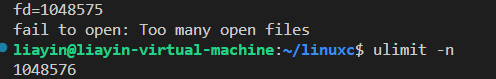

查看默认值

### **4.7文件描述符的复制**

#### **4..7.1 dup函数**

因此，当使用dup函数复制文件描述符1时，实际上是复制了指向标准输出的文件描述符，也就是复制了输出流的指针。

用dup函数复制文件描述符时，返回的是新复制的文件描述符，即原始文件描述符的副本。这意味着可以通过新的文件描述符来对同一文件进行读写操作，而不影响原始文件描述符。

~~~c
1 #include <unistd.h>
2 int dup(int oldfd);
3 功能：复制oldfd文件描述符，并分配一个新的文件描述符，新的文件描述符是调用进程文件描述符表中最小可用的文件描述符。
4 参数：
5 要复制的文件描述符oldfd。
6 返回值：
7 成功：新文件描述符。
8 失败：返回－1，错误代码存于errno中
~~~

~~~c
#include <stdio.h>
#include <unistd.h>
#include <stdlib.h>
#include <sys/types.h>
#include <sys/stat.h>
#include <fcntl.h>
#include <string.h>

int main(void)
{
    //通过dup函数复制一个文件描述符
    int fd;
    //dup执行后给返回值文件描述符分配的值是文件描述符表中最小可用的文件描述符
    fd = dup(1);
    printf("fd = %d\n", fd);
    //由于通过dup函数将1这个文件描述符复制了一份为fd，所以fd现在就相当于1，所以写数据就是向终端写入数据
    write(fd, "this ia a book\n", strlen("this ia a book\n"));

    return 0;
}
~~~


~~~c
#include <stdio.h>
#include <unistd.h>
#include <stdlib.h>
#include <sys/types.h>
#include <sys/stat.h>
#include <fcntl.h>

int main(int argc, char *argv[])
{
	int fd_file;
	fd_file = open("test.txt", O_WRONLY | O_CREAT | O_TRUNC, 0664);
	if(fd_file == -1)
	{
		perror("fail to open");
		exit(1);
	}

	close(1);

	int fd = dup(fd_file);
	printf("hello world\n");
	printf("fd = %d\n", fd);

	return 0;
}
~~~

 实现 输出重定向,先往文件输出,再回到标准输出

~~~c
#include <stdio.h>
#include <stdlib.h>
#include <unistd.h>
#include <string.h>
#include <sys/types.h>
#include  <sys/wait.h>
#include <fcntl.h>
int main(){
    int fd1;
    int fd2;
    fd2=dup(1);
    printf("fd2===%d\n",fd2);
    fd1=open("mm.txt",O_RDWR |O_CREAT,0664);
    printf("fd1===%d\n",fd1);
    close(1);  //关闭标准输出文件描述符
    int fd3=dup(fd1);
    printf("AAAAAAAAAA\n");
    printf("fd3===%d\n",fd3);
    
    close(1);
    int fd4=dup(fd2);
    printf("BBBBBBBB\n");
    printf("fd4===%d\n",fd4);

}
~~~


#### **4.7.2 dup2** **函数 重定向** 

**#include <unistd.h>** 

~~~c
**int dup2(int oldfd, int newfd)** 

**功能：** 

复制一份打开的文件描述符 oldfd，并分配新的文件描述符 newfd，newfd 也标识 oldfd 所标识的文件。 

**注意：** 

newfd 是小于文件描述符最大允许值的非负整数
    如果 newfd 是一个已经打开的文件描述符，则首先关闭该文件，然后再复制。 

**参数：**

要复制的文件描述符 oldfd 

分配的新的文件描述符 newfd 

**返回值：** 

成功：返回 newfd 

失败：返回-1，错误代码存于 errno 中
~~~


~~~c
#include <stdio.h>
#include <unistd.h>
#include <stdlib.h>
#include <sys/types.h>
#include <sys/stat.h>
#include <fcntl.h>
int main(void)
{
	int fd1;
	int fd2;
  
	
	fd1 = open("abc.txt", O_CREAT | O_WRONLY, 0664);
	if (fd1 < 0)
	{
		perror("fail to open");
		exit(1);
	}
    
    //首先关闭1文件描述符，然后将fd1复制给1，意味着1和fd1都标识test.txt文件,返回值跟1是一样的
	fd2 = dup2(fd1, 1);
    printf("hello world\n");
	printf("fd2 = %d\n", fd2);
    
	return 0;
}
~~~

~~~c
#include <stdio.h>
#include <unistd.h>
#include <stdlib.h>
#include <sys/types.h>
#include <sys/stat.h>
#include <fcntl.h>

int main(int argc, char *argv[])
{
	int fd1;
    //如果使用dup2，则需要实现给第二个参数对应的变量赋一个初始值
	int fd2 = 3;
	
    //将1复制一份为fd2，所以fd2标识的是标准输出
	dup2(1, fd2);//3->1
	printf("fd2 = %d\n", fd2);
	
	fd1 = open("test.txt", O_CREAT | O_RDWR, 0664);//4

    //输出重定向：关闭文件描述符1，将fd1复制一份为1，所以1此时标识的是test.txt文件
	dup2(fd1, 1);
	printf("hello world\n");

    //再次实现标准输出：关闭文件描述符1，将fd2复制一份为1，所以1此时标识的是标准输出
	dup2(fd2, 1);
	printf("你好\n");
	return 0;
}
~~~


# 五、有名管道

有名管道(FIFO)t和管道(PIPE)基本上相同,但也有一些不同点:

特点:

1. 半双工,数据在同一时刻只能在一个方向上流动.

2. 写入FIFO中的数遵循先入先出的规则.

3. FIFO所传送的数据是无格式的,这要求对FIFO的读出方与写入方必须事先约定好数据的格式,比如说多少字节算一个消息等.
4. FIFO在文件系统中作为一个特殊文件而存在并且在文件系统中可见,所以有名管道可以实现不相关的进程间通信,但FIFO中的内容却可以存放在内存中.
5. 管道在内存中对应一个缓冲区,不同的系统其大小不一定相同.
6. 从FIFO读数据是一次性操作,数据一旦被读,它就从FIFO中被抛弃,释放空间以便写多的数据.
7. 当使用FIFO的进程退出后,**FIFO文件将继续保存在文件系统中以便以后使用.**
8. FIFO有名字,不相关的进程可以通过打开命名管道进行通信.


### 5.2有名管道的创建

1. 方法一: 用shell 命令mkfifo创建有名管道    mkfifo myfifo  

2. 方法二: 使用函数mkfifo

   ```c
   #include <sys/types.h>
   #include <sys/stat.h>
   int mkfifo(const char *pathname, mode_t mode);
   功能:创建一个有名管道,产生一个本地文件系统可见的pathname
   参数:
      pathname: 有名管道创建后生成的文件,可以带路径
      mode :管道文件的权限,一般通过八进制数设置即可 : 比如: 0664
      返回值:
       成功:   0
       失败   -1
   ```

   ```c
   #include <stdio.h>
   #include <stdlib.h>
   #include <unistd.h>
   #include <string.h>
   #include <sys/types.h>
   #include <sys/stat.h>
   #include  <sys/wait.h>
   #include <fcntl.h>
   int main(){
       if(mkfifo("myfifo_file",0664)==-1){
           perror("fifo_file创建失败");
           exit(1);
       }
       return 0;
   }
   
   
   
   #include <stdio.h>
   #include <stdlib.h>
   #include <unistd.h>
   #include <string.h>
   #include <sys/types.h>
   #include <sys/stat.h>
   #include <sys/wait.h>
   #include <fcntl.h>
   #include <errno.h>
   int main(){
       if(mkfifo("myfifo_file",0664)==-1){
          // printf("errno====%d",errno);
          if(errno!=EEXIST){
           perror("fifo_file创建失败");
           exit(1);
       }
       }
       return 0;
   
   
   }
   ```
   
   

### 5.3 有名管道的读写操作:

~~~c
#include <stdio.h>
#include <stdlib.h>
#include <unistd.h>
#include <string.h>
#include <sys/types.h>
#include <sys/stat.h>
#include  <sys/wait.h>
#include <fcntl.h>
#include <errno.h>
int main(){
    //创建mkfifo函数创建有名管道
    if(mkfifo("myfifo2",0664)== -1){
          if(errno!=EEXIST){
        perror("fifo_file创建失败");
        exit(1);
       }
    }
    int fd;
    fd=open("myfifo2",O_RDWR);
    if(fd==-1){
        perror("fail to open!");
        exit(1);
    }
    //往管道写数据
    if(write(fd,"this is a book",strlen("this is a book")) ==-1){
        perror("fail to write");
        exit(1);
    }
    write(fd,"I am a teacher",strlen("I am a teacher"));
    //读管道数据
    char buffer[32]="";
    if(read(fd,buffer,sizeof(buffer))==-1){
        perror("fail to read");
        exit(1);
    }
    printf("buffer===[%s]\n",buffer);

    if(read(fd,buffer,sizeof(buffer))==-1){
        perror("fail to read");
        exit(1);
    }
    printf("buffer===[%s]\n",buffer);


    //close函数关闭文件描述符;
    close(fd);


    return 0;

}
~~~


### 5.4 有名管道实现进程间通信

由于有名管道在本地创建了一个管道文件,所以不相关的进程间也可以实现通信.

#### 5.4.1 发送端 send

~~~c
#include <stdio.h>
#include <stdlib.h>
#include <unistd.h>
#include <string.h>
#include <sys/types.h>
#include <sys/stat.h>
#include  <sys/wait.h>
#include <fcntl.h>
#include <errno.h>
int main(){
    /**
       创建了二个有名管道;
    */
    if(mkfifo("myfifo3",0664)==-1){
        if(errno !=EEXIST){
            perror("fail to mkfifo..");
            exit(1);
        }

    }
     if(mkfifo("myfifo4",0664)==-1){
        if(errno !=EEXIST){
            perror("fail to mkfifo..");
            exit(1);
        }

    }
    //打开两个有名管道得到文件描述符
    int fd_w,fd_r;
    if((fd_w=open("myfifo3",O_WRONLY))== -1){
        perror("fail to open");
        exit(1);
    }
    if((fd_r=open("myfifo4",O_RDONLY))== -1){
        perror("fail to open");
        exit(1);
    }
    char buffer[128]="";
    ssize_t bytes;
    while(1){
        fgets(buffer,sizeof(buffer),stdin);
        buffer[strlen(buffer)-1]='\0';
        //send进程负责将数据写入myfifo3,接着从myfifo4中读取数据.
        if((write(fd_w,buffer,sizeof(buffer)))==-1){
            perror("fail to writer");
            exit(1);
        }
        if((bytes=read(fd_r,buffer,sizeof(buffer)))==-1){
            perror("fail to read.");
            exit(1);
        }
        printf("form recv: %s\n",buffer);
    }

    return  0;
}
~~~


#### 5.4.2 接收端recv

~~~c
#include <stdio.h>
#include <stdlib.h>
#include <unistd.h>
#include <string.h>
#include <sys/types.h>
#include <sys/stat.h>
#include  <sys/wait.h>
#include <fcntl.h>
#include <errno.h>
int main(){
    /**
       创建了二个有名管道;
    */
    if(mkfifo("myfifo3",0664)==-1){
        if(errno !=EEXIST){
            perror("fail to mkfifo..");
            exit(1);
        }

    }
     if(mkfifo("myfifo4",0664)==-1){
        if(errno !=EEXIST){
            perror("fail to mkfifo..");
            exit(1);
        }

    }
    //打开两个有名管道得到文件描述符
    int fd_w,fd_r;
     if((fd_r=open("myfifo3",O_RDONLY))== -1){
        perror("fail to open");
        exit(1);
    }

    if((fd_w=open("myfifo4",O_WRONLY))== -1){
        perror("fail to open");
        exit(1);
    }
   
    char buffer[128]="";
    ssize_t bytes;
    while(1){
      
        if((bytes=read(fd_r,buffer,sizeof(buffer)))==-1){
            perror("fail to read.");
            exit(1);
        }
        printf("form send: %s\n",buffer);
         fgets(buffer,sizeof(buffer),stdin);
        buffer[strlen(buffer)-1]='\0';
         write(fd_w,buffer,sizeof(buffer));

    }

    return  0;
}
~~~

###       5.5有命管道的读写规律

####      5.5.1 读取端都存在,只读不写.

```c
#include <stdio.h>
#include <stdlib.h>
#include <unistd.h>
#include <string.h>
#include <sys/types.h>
#include <sys/stat.h>
#include  <sys/wait.h>
#include <fcntl.h>
#include <errno.h>
int main(){
    if(mkfifo("myfifo5",0664)== -1){
        if(errno !=EEXIST){
            perror("fail to mkfifo");
            exit(1);
        }
}
//读写端都在,只读不写
//如果原本管道有数据,则正常读取数据
//如果管道中没有数据,则read函数会阻塞等待.
int fd;
if((fd=open("myfifo5",O_RDWR))==-1){
    perror("fail to open");
    exit(1);
}
char buffer[128]="";
write(fd,"hello world",11);
read(fd,buffer,sizeof(buffer));
printf("buffer= %s\n",buffer);
 //再读一次
 read(fd,buffer,sizeof(buffer));
 printf("buffer= %s\n",buffer);
return 0;

}
```


#### 5.5.2 读写端都存在,只写不读


~~~c
#include <stdio.h>
#include <stdlib.h>
#include <unistd.h>
#include <string.h>
#include <sys/types.h>
#include <sys/stat.h>
#include  <sys/wait.h>
#include <fcntl.h>
#include <errno.h>
int main(){
 if(mkfifo("myfifo6",0664)== -1){
     if(errno !=EEXIST){
         perror("fail to mkfifo");
         exit(1);
     }

 }
 //读写端都在,只写不读
 //当有名管道的缓冲区写满后,write函数会发生阻塞
 //默认有名管道的缓冲区为64k字节..
 int fd;
 if((fd=open("myfifo6",O_RDWR))==-1){
     perror("fail to open");
     exit(1);
 }
 int count=0;
 while(1){
     write(fd,"",1024);
     count++;
     printf("count= %d\n",count);

 }
 return 0;
~~~


#### 5.5.3 在一个进程中,只有读端,没有写端

~~~c
#include <stdio.h>
#include <stdlib.h>
#include <unistd.h>
#include <string.h>
#include <sys/types.h>
#include <sys/stat.h>
#include  <sys/wait.h>
#include <fcntl.h>
#include <errno.h>
int main(){
  
    
     if(mkfifo("myfifo7",0664) == -1){
        if(errno !=EEXIST){
            perror("fail to mkfifo");
            exit(1);
        }

    }
   printf("===============================\n");
    // 在一个进程中,只有读端,没有写端
    //会在open函数位置阻塞.
    int fd;
    if((fd=open("myfifo7",O_RDONLY)) ==-1){
        perror("fail to open");
        exit(1);
    }

     printf("********************\n");
     

    char buffer[128]="";
    ssize_t bytes;
    while(1){
        if(bytes=read(fd,buffer,sizeof(buffer)) ==-1){
            perror("fail to read..");
            exit(1);
        }
        printf("bytes= %ld\n",bytes);
        printf("buffer== %s\n",buffer);
    }
    
    return 0;
}
~~~

#### 5.5.4 在一个进程中,只有写端,没有读端

~~~c
#include <stdio.h>
#include <stdlib.h>
#include <unistd.h>
#include <string.h>
#include <sys/types.h>
#include <sys/stat.h>
#include  <sys/wait.h>
#include <fcntl.h>
#include <errno.h>
int main(){
  
    
     if(mkfifo("myfifo7",0664) == -1){
        if(errno !=EEXIST){
            perror("fail to mkfifo");
            exit(1);
        }

    }
     printf("===========================\n");
     /**
        在一个进程中,只有写端,没有读端
        也会在open函数位置阻塞.
     */
    int fd;
    if((fd=open("myfifo7",O_WRONLY)) ==-1){
        perror("fail to open");
        exit(1);
    }
   printf("********************");
    while(1){
         write(fd,"hello linuxc",12);
         printf("ok!!!\n");
         sleep(1);
    }
    
    return 0;
}
~~~

# 六.线程

## 6.1 线程的概念:

每个进程都有自己的数据段,代码段和堆栈段,这就造成进程在创建,切换,撤销操作时,需要较大的系统开销.为了减少系统开销,从进程中演化出了线程.

线程存在于进程中,共享进程的资源.

线程是进程中独立控制流(具有独立执行的一条路径),由环境(包括寄存器组和程序计数器)和一系列的执行指令组成.(线程就是具有独立执行的一条路径.)

每个进程都有一个地址空间和一个控制线程.

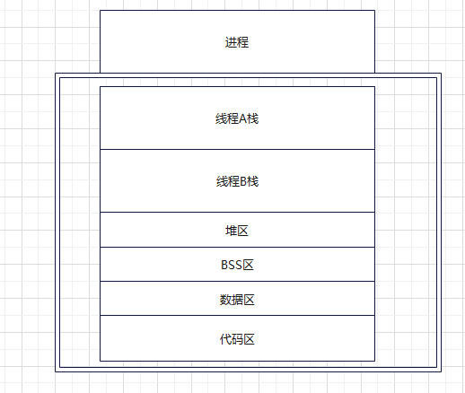

### 6.1.1 线程和进程的比较

调度:  线程是CPU调度和分派的基本单位.

进程是系统中程序执行和资源分配的基本单位.

线程自己一般不拥有资源(除必不要少的程序计数器,寄存器和栈),但它可以去访问其所属进程的资源,(打开的文件,IO设备等.)

系统开销:

​    同一个进程中的多个线程可共享一地址空间,因此它们之间的同步和通信的实现也变得简单.

  在进程切换时候涉及到整个当前进程CPU环境的保存以及新被调度运行的进程的CPU的环境设置.

 而线程切换只需要保存和设置少量的寄存器的内容,并不涉及存储器管理方面的操作.这样就更有效地使用系统资源和提高系统吞吐量.

并发性:

  不仅进程间可以并发执行,而且在一个进程中的多个线程之间也可以并发执行.

总结: 

   一般把线程称为轻量级的进程.

  一个进程可以创建多个线程,多个线程可以共享一个进程的资源

每一个进程创建的时候系统会自动给其4G虚拟内存,3G用户空间是私有的,所以进程切换时,用户空间也会切换,所以会增加系统开销,而一个进程中的多个线程共享一个进程的资源,所以线程切换时不用切换这些资源,效率会更高.

线程的调度机制跟进程是一样的,多个线程来回切换运行(轮询)

### 6.1.2 多线程的用处:

   1)多任务程序的设计

   2)并发程序设计

   3)网络程序设计(网络的利用效率)

   4)数据共享---(同一个进程中的不同线程共享进程的数据空间,方便不同线程间的数据共享.

   5)在多个CPU系统中,可以实现真正的并行处理


## 6.2 线程的基本操作

### 6.2.1 线程的创建pthread_create -lpthread

  ~~~C
#include <pthread.h>
   int pthread_create(pthread_t *thread, const pthread_attr_t *attr,void *(*start_routine) (void *), void *arg);
                        线程id指针			线程属性，默认null			  线程处理函数指针			   给线程函数传参 
		pthread_create(指针，属性null,线程函数指针，函数传参)
功能:创建一个新的子线程
参数:
   thread : 当前创建的线程id
   arrt  : 线程的属性,设置为NULL以默认的属性创建
   start_routine : 线程处理函数,如果当前函数执行完毕,则表示子线程也执行完毕.
   arg : 给线程处理函数传参数用的.
   返回值:
    成功: 0
    失败: 非0
  ~~~

 注意: 与fork不同的是pthread_create创建的线程不与父线程在同一点开始执行的,而是从指定的处理函数开始运行的,该函数运行完后,此线程也就退出了.

线程依赖进程存在的,如果创建线程的进程结束了,那么线程也就结束了.

线程函数的程序在pthread库中,故链接时要加上参数-lpthread.

示例:

~~~c
#include <stdio.h>
#include <stdlib.h>
#include <pthread.h>

void  *fun1(void *arg){
    printf("子线程正在运行中\n");
}

int main(){
  
     printf("主线程正在执行中\n");

    //pthread_create函数创建子线程
      pthread_t thread;
      if(pthread_create(&thread,NULL,fun1,NULL)!=0){
        perror("fail to pthread_create");
        exit(1);
      }
      //由进程结束后,进程中所有的线都会强制退出.
     while(1);
    return 0;
}
~~~


### 6.2.2 线程调度机制

总结: 线程处理函数是**并行**执行的,是来回交替执行,但是普通函数是一定按照先后调用函数顺序执行.

~~~c
#include <stdio.h>
#include <stdlib.h>
#include <pthread.h>
#include <unistd.h>


void  *fun1(void *arg){
    printf("子线程A正在运行中\n");
    sleep(1);
    printf("---------------A--------------\n");
}
void  *fun2(void *arg){
    printf("子线程B正在运行中\n");
    sleep(1);
    printf("---------------B--------------\n");
}
int main(){

     printf("主线程main正在运行中\n");
    pthread_t thread1,thread2;
    if(pthread_create(&thread1,NULL,fun1,NULL)!=0){
       perror("fail to pthread_create");

    }
    if(pthread_create(&thread2,NULL,fun2,NULL)!=0){
       perror("fail to pthread_create");
       
    }
     while(1);
    return 0;
}

~~~


~~~C
#include <stdio.h>
#include <stdlib.h>
#include <pthread.h>
#include <unistd.h>


void  *fun1(void *arg){
    printf("子线程A正在运行中\n");
    for(int i=0;i<100;i++){
        printf("i===%d\n",i);
    }
    sleep(1);
    printf("---------------A--------------\n");
}
void  *fun2(void *arg){
    printf("子线程B正在运行中\n");
      for(int j=0;j<100;j++){
        printf("j===%d\n",j);
    }
    sleep(1);
    printf("---------------B--------------\n");
}
int main(){

     printf("主线程main正在运行中\n");
    pthread_t thread1,thread2;
    if(pthread_create(&thread1,NULL,fun1,NULL)!=0){
       perror("fail to pthread_create");

    }
    if(pthread_create(&thread2,NULL,fun2,NULL)!=0){
       perror("fail to pthread_create");
       
    }
     while(1);
    return 0;
}

~~~


### 6.2.3 线程处理函数的传参//子线程共用同一个参数空间

~~~c
#include <stdio.h>
#include <stdlib.h>
#include <pthread.h>
#include <unistd.h>
int n=200;

void  *fun1(void *arg){
      printf("子线程A n=%d\n",n);
      n++;
      int k=*(int *)arg;
      printf("子线程A  K=%d\n",k);
      *(int *)arg=555;
}
void  *fun2(void *arg){
    sleep(1);
     printf("子线程B n=%d\n",n);
     int k=*(int *)arg;
     printf("子线程B  K=%d\n",k);
   
}
int main(){

     printf("主线程main正在运行中\n");
     int k=100;
    pthread_t thread1,thread2;
    if(pthread_create(&thread1,NULL,fun1,(void *)&k)!=0){
       perror("fail to pthread_create");

    }
    if(pthread_create(&thread2,NULL,fun2, (void *)&k)!=0){
       perror("fail to pthread_create");
       
    }
     while(1);
    return 0;
}
//子线程共用同一个参数空间
~~~


## 6.3 线程的阻塞回收pthread_join

~~~c
 #include <pthread.h>

       int pthread_join(pthread_t thread, void **retval);
功能: 等待子线程结束,并回收子线程资源.
   参数:
    thread: 被等待的线程号.
    retval: 用来存储线程退出状态的指针的地址.
   返回值:
   成功返回  0,  失败返回非 0
~~~

~~~c
#include <stdio.h>
#include <stdlib.h>
#include <pthread.h>
#include <unistd.h>

void  *fun1(void *arg){
    printf("子线程正在运行中\n");
    sleep(3);
    printf("子线程要退出了....\n");
}

int main(){

    printf("主线程正在运行中..\n");

    pthread_t thread;
    if(pthread_create(&thread,NULL,fun1,NULL)!=0){
        perror("fail to pthread_create");
        exit(1);
    }
    //通过用pthread_join函数阻塞等待子程线退出
    if(pthread_join(thread,NULL)!=0){
        perror("fail to pthread_join");
        exit(1);
    }
    printf("进程要退出了\n");
    return  0;
}
~~~

通过pthread_join获取子线程的退出状态值

~~~c
#include <stdio.h>
#include <stdlib.h>
#include <pthread.h>
#include <unistd.h>

void  *fun1(void *arg){
    static int k=200;
    printf("子线程正在运行中\n");
    sleep(3);
    printf("子线程要退出了....\n");

    //子线程如果要返回退出状态,可以通过返回值或者pthread_exit函数
    return   (void *)&k;
}

int main(){

    printf("主线程正在运行中..\n");

    pthread_t thread;
    if(pthread_create(&thread,NULL,fun1,NULL)!=0){
        perror("fail to pthread_create");
        exit(1);
    }
    //通过用pthread_join函数阻塞等待子程线退出
    int *num;
    if(pthread_join(thread,(void **)&num)!=0){
        perror("fail to pthread_join");
        exit(1);
    }
    printf("retvalue==%d\n",*num);
    printf("进程要退出了\n");
    return  0;
}
~~~

## 6.4线程自动分离pthread_detach

线程的结合态和分离态 

linux线程执行和windows不同，pthread有两种状态： 

​	可结合的（joinable）或者是分离的（detached），线程默认创建为可结合态。 

​	如果线程是**joinable**状态，当线程函数自己返回退出时或pthread_exit时都**不会释放线程所占用堆栈和线程描述符**（总计8K多）。只有当你**调用了pthread_join**之后这些资源才会被释放。 

​	若是**detached**状态的线程，这些资源在线程函数退出时或pthread_exit时**自动会被释放**，使用pthread_detach函数将线程设置为分离态。 

创建一个线程后应回收其资源，但使用pthread_join函数会使调用者阻塞，故Linux提供了 

线程分离函数：pthread_detach

~~~c
  #include <pthread.h>

       int pthread_detach(pthread_t thread);
功能: 使调用线程与当前线程分离,使其成为一个独立的线程.该线程终止时,系统会自动回收它的资源.
参数:
   thread : 指定的子线程的id
返回值:
     成功: 0
     失败: 非0
    
    
~~~

示例:

~~~c
#include <stdio.h>
#include <stdlib.h>
#include <pthread.h>
#include <unistd.h>

void *fun1(void *arg){
   printf("子线程正在运行中...\n");
   sleep(3);
   printf("子线程即将退出了\n");
}

int main(){

     printf("主线程正在运行中...\n");
     pthread_t thread;
     if(pthread_create(&thread,NULL,fun1,NULL) !=0){
        perror("fail to pthread_create");
        exit(1);
     }
     if(pthread_detach(thread)!=0){
        perror("fail to pthread_detach");
        exit(1);
     }
     /*
       如果子线程已经设置了分离态,那么就不要再使用pthread_join函数了,因为这个函数是个阻塞函数,如果子线程不退出,那么就会导致当前线程(main主线无法继续执行,这样大大限制了代码运行效率)
     if(pthread_join(thread,NULL) !=0){
        perror("fail to pthread_join");
        exit(1);
     }
     */
     while(1){
        printf("hello linuxc\n");
        sleep(1);
     }


    return 0;
}

~~~


## 6.5线程退出pthread_exit

  线程退出函数

```c
 #include <pthread.h>
void pthread_exit(void *retval);
功能: 退了正在执行的线程.
 参数:
   retval : 当前线程的退出状态值.
   这个值可以被调用pthread_join函数的线程接收到.
 返回值: 无
 
```

~~~c
#include <stdio.h>
#include <stdlib.h>
#include <pthread.h>
#include <unistd.h>

void *fun1(void *arg){
    static char buffer[]="this is a book";
    printf("子线程正在运行中...\n");
    for(int k=0;k<10;k++){
        if(k==5){
            //退出当前线程
            //pthread_exit(NULL);
            pthread_exit(buffer);
        }
        printf("==========================\n");
        sleep(1);
    }

}
int main(){

    printf("主线程正在运行中...\n");
    pthread_t thread;
    if(pthread_create(&thread,NULL,fun1,NULL) !=0){
        perror("fail to pthread_create");
        exit(1);
    }
   // pthread_join(thread,NULL);
    char *str;
     pthread_join(thread,(void **)&str);
     printf("str====%s\n",str);
    printf("进程要退出了....\n");

    return 0;
}
~~~

注意: 

   一个进程中的多个线程是共享该进程的数据段,因此,通常线程退出后所占用的资源并不会释放,如果释放资源,结合态需要通过pthread_join函数, 分离态则自动释放.

## 6.6 线程的取消pthread_cancel

~~~c
 #include <pthread.h>

  int pthread_cancel(pthread_t thread);
功能:取消线程
参数:  
   thread:要销毁的线程的id
   返回值:
    成功:  0
    失败:  非 0
    
~~~

pthread_cancel函数的实质是发信号给目标线程thread,使目标线程退出.此函数只是发送终止信号给目标线程,不会等待取消目标线程执行完才返回.

 然而发送成功并不意味着目标线程一定就会终止,线程被取消时,线程的取消属性会决定线程能否被取消以及何时被取消.

线程的取消状态：即线程能不能被取消

线程取消点：即线程被取消的地方

线程的取消类型：在线程能被取消的状态下,是立马被取消结束还是执行到取消点的时候被取消结束.

~~~c
#include <stdio.h>
#include <stdlib.h>
#include <pthread.h>
#include <unistd.h>
void *fun1(void *arg){
     while(1){
        printf("子线程正在运行中....\n");
        sleep(1);
     }
}
int main(){

     pthread_t thread;
     if(pthread_create(&thread,NULL,fun1,NULL) !=0){
        perror("fail to pthread_create");
        exit(1);
     }
     sleep(5);
     pthread_cancel(thread);
     pthread_join(thread,NULL);
    printf("进程即将结束\n");

    return 0;
}
~~~

## 6.7线程的取消状态pthread_setcancelstate

在Linux 系统中,线程默认可以被取消,编程时可以通过pthread_setcancelstate函数设置线程是否可以被取消.

~~~c
   #include <pthread.h>

   int pthread_setcancelstate(int state, int *oldstate);
   功能: 设置线程是否被取消
   参数: 
     state: 新的状态
     PTHREAD_CANCEL_DISABLE :不可以被取消
     PTHREAD_CANCEL_ENABLE : 可以被取消
     oldstate: 保存调用线程原来的可取消状态的内存地址
   返回值:
    成功:  0
    失败:  非0
~~~

~~~c
#include <stdio.h>
#include <stdlib.h>
#include <pthread.h>
#include <unistd.h>
void *fun1(void *arg){
    // 通过此函数设置线程是否取消状态
    // 设置可以取消,默认就是可以取消
    // pthread_setcancelstate(PTHREAD_CANCEL_ENABLE,NULL);
    // 设置不可以取消
      pthread_setcancelstate(PTHREAD_CANCEL_DISABLE,NULL);
     while(1){
        printf("子线程正在运行中....\n");
        sleep(1);
     }
}
int main(){
     pthread_t thread;
     if(pthread_create(&thread,NULL,fun1,NULL) !=0){
        perror("fail to pthread_create");
        exit(1);
     }
     sleep(5);
     pthread_cancel(thread);
     pthread_join(thread,NULL);
    printf("进程即将结束\n");
    return 0;
}
~~~

## 6.8 线程的取消点pthread_testcancel

   线程被取消后,该线程并不是马上终止,默认情况下线程执行到取消点时才被终止,编程时可以通过pthread-testcancel函数设置线程的取消点.

~~~c
 #include <pthread.h>
   void pthread_testcancel(void);
   功能: 设置线程的取消点
   参数 无
   返回值: 无
~~~

~~~c
#include <stdio.h>
#include <stdlib.h>
#include <pthread.h>
#include <unistd.h>
void *fun1(void *arg){
  
     while(1){
        printf("子线程正在运行中....\n");
        sleep(1);
        pthread_testcancel();
     }
}
int main(){

     pthread_t thread;
     if(pthread_create(&thread,NULL,fun1,NULL) !=0){
        perror("fail to pthread_create");
        exit(1);
     }
     sleep(5);
     pthread_cancel(thread);
     pthread_join(thread,NULL);
     printf("进程即将结束\n");

    return 0;
}
~~~


## 6.9 线程的取消类型pthread_setcanceltype

  线程被取消后,该线程并不是马上终止,默认情况线程执行到取消点时才被终止,编程时可以通过pthread_setcanceltype函数设置线程是否可以立即被取消.

~~~c
  #include <pthread.h>

  int pthread_setcanceltype(int type, int *oldtype);
  type:
      PTHREAD_CANCEL_ASYNCHRONOUS:  立即取消
      PTHREAD_CANCEL_DEFERRED : 不立即取消
  oldtype:
       保存调用线程原来的可以取消类型的内存地址
   

~~~

~~~c
#include <stdio.h>
#include <stdlib.h>
#include <pthread.h>
#include <unistd.h>
void *fun1(void *arg){
    //通过此函数设置线程是否取消状态
    //设置可以取消,默认就是可以取消
     pthread_setcancelstate(PTHREAD_CANCEL_ENABLE,NULL);
    //设置立取取消
     //pthread_setcanceltype(PTHREAD_CANCEL_ASYNCHRONOUS,NULL);
     //设置不立即取消
     pthread_setcanceltype(PTHREAD_CANCEL_DEFERRED,NULL);
     while(1){
        printf("子线程正在运行中....\n");
        sleep(1);
     }
}
int main(){

     pthread_t thread;
     if(pthread_create(&thread,NULL,fun1,NULL) !=0){
        perror("fail to pthread_create");
        exit(1);
     }
     sleep(5);
     pthread_cancel(thread);
     pthread_join(thread,NULL);
    printf("进程即将结束\n");

    return 0;
}
~~~


## 6.10 线程退出清理函数pthread_cleanup_push/pop

 和进程的退出清理一样,线程也可以注册它的**退出时要调用的函数**,这样的函数称为线程清理处理程序. 

注意:

​    线程可以建立多个清理处理程序.

​    处理程序在**栈**中,所有它们执行顺序与它们注册时顺序相反.

当线程执行以下动作时会调用清理函数.

  1.调用pthread_exit()退出线程

  2.响应其它线程的取消请求,

 3.用非零execute调用pthread_cleanup_pop.

~~~c
  #include <pthread.h>

  void pthread_cleanup_push(void (*routine)(void *), void *arg);
  功能:将清除函数压栈,即注册清理函数.
  参数
  routine : 线程清理函数的指针
  arg  传给线程清理函数的参数.
 返回值:无
  
                                
  void pthread_cleanup_pop(int execute);
  功能: 将清理函数弹栈,即删除清理函数
  参数:
     execute : 线程清理函数执行标志位.
      非0 弹出清理函数,执行清理函数
      0  弹出清理函数,不执行清理函数.
  返回值:  无
  
~~~

~~~c
#include <stdio.h>
#include <stdlib.h>
#include <pthread.h>
#include <unistd.h>
#include <string.h>

void myclean(void *arg){
    printf("myclean ptr=%s\n",(char *)arg);
    free((char *)arg);
      
}

void *fun1(void *arg){
    printf("子线程正在运行中....\n");
    char *ptr=NULL;
    ptr=(char*)malloc(100);
    pthread_cleanup_push(myclean,(void *)(ptr));
    bzero(ptr,100);
    strcpy(ptr,"this is a book");
    printf("注册清理函数!\n");
    sleep(3);
    pthread_exit(NULL);
    printf("删除清理函数\n");
    pthread_cleanup_pop(1);

}

int main(){


    pthread_t thread;
    if(pthread_create(&thread,NULL,fun1,NULL)!=0){
        perror("fail to pthread_create");
        exit(1);
    }
    pthread_join(thread,NULL);
    printf("进程即将要结束....\n");

}
~~~


~~~c
#include <stdio.h>
#include <stdlib.h>
#include <pthread.h>
#include <unistd.h>
#include <string.h>

void myclean(void *arg){
    printf("myclean ptr=%s\n",(char *)arg);
    free((char *)arg);
      
}

void *fun1(void *arg){
    printf("子线程正在运行中....\n");
    char *ptr=NULL;
    ptr=(char*)malloc(100);
    pthread_cleanup_push(myclean,(void *)(ptr));
    bzero(ptr,100);
    strcpy(ptr,"this is a book");
    printf("注册清理函数!\n");
    sleep(3);
  
    printf("删除清理函数\n");
    pthread_cleanup_pop(1);

}

int main(){


    pthread_t thread;
    if(pthread_create(&thread,NULL,fun1,NULL)!=0){
        perror("fail to pthread_create");
        exit(1);
    }
    //取消线程
    pthread_cancel(thread);
    pthread_join(thread,NULL);
    printf("进程即将要结束....\n");

}
~~~


~~~c
#include <stdio.h>
#include <stdlib.h>
#include <pthread.h>
#include <unistd.h>
#include <string.h>

void fun1(void *arg){
     printf("fun1...\n");
    printf("myclean ptr=%s\n",(char *)arg);
    free((char *)arg);
      
}

void fun2(void *arg){
     printf("fun2...\n");
      
}


void *fun(void *arg){
    printf("子线程正在运行中....\n");
    char *ptr=NULL;
    ptr=(char*)malloc(100);
    pthread_cleanup_push(fun1,(void *)(ptr));
    pthread_cleanup_push(fun2, NULL);
    bzero(ptr,100);
    strcpy(ptr,"this is a book");
    printf("注册清理函数!\n");
    sleep(3);
  
    printf("删除清理函数\n");
    printf("clearup1...\n");
    pthread_cleanup_pop(1);
    printf("clearup2...\n");
    pthread_cleanup_pop(1);

}

int main(){


    pthread_t thread;
    if(pthread_create(&thread,NULL,fun,NULL)!=0){
        perror("fail to pthread_create");
        exit(1);
    }
    //取消线程
  //  pthread_cancel(thread);
    pthread_join(thread,NULL);
    printf("进程即将要结束....\n");

}
~~~


# 七.同步互斥

##  7.1 同步与互斥概念

在多任务操作系统中，同时运行的多个任务可能都需要访问/使用同一种资源 

多个任务之间有依赖关系，某个任务的运行依赖于另一个任务 

同步和互斥就是用于解决这两个问题的。 

**互斥:** 

一个公共资源同一时刻只能被一个进程或线程使用，多个进程或线程不能同时使用公共 资源。

POSIX标准中进程和线程同步和互斥的方法,主要有信号量和互斥锁两种方式。 

**同步:** 

两个或两个以上的进程或线程在运行过程中协同步调，按预定的先后次序运行。 同步就是在互斥的基础上有顺序。

## 7.2互斥锁mutex

mutex是一种简单的加锁的方法来控制对共享资源的访问，mutex只有两种状态,即上 锁(lock)和解锁(unlock)。 

在访问该资源前，首先应申请mutex，如果mutex处于unlock状态，则会申请到mutex并立即lock； 

如果mutex处于lock状态，则默认阻塞申请者。unlock操作应该由lock者进行。 

## **7.3互斥锁的操作** 

### **7.3.1初始化互斥锁**

mutex用pthread_mutex_t数据类型表示，在使用互斥锁前,必须先对它进行初始化。 

#### **静态分配的互斥锁：** 

pthread_mutex_t mutex = PTHREAD_MUTEX_INITIALIZER; 

#### **动态分配互斥锁:** 

pthread_mutex_t mutex; 

pthread_mutex_init(&mutex, NULL); 

在所有使用过此互斥锁的线程都不再需要使用时候，应调用pthread_mutex_destroy销毁 

#### **初始化互斥锁**pthread_mutex_init

```c
1 #include <pthread.h>
    方法一：
    pthread_mutex_t list_mutex = PTHREAD_MUTEX_INITIALIZER;
	方法二：
	int pthread_mutex_init(pthread_mutex_t *mutex, const pthread_mutexattr_t* mutexattr);
3 功能：初始化一个互斥锁
4 参数：
5 mutex：指定的互斥锁
6 mutexattr：互斥锁的属性，为NULL表示默认属性
7 返回值：
8 成功：0
```

### **7.3.2互斥锁上锁**pthread_mutex_lock

~~~c
1 #include <pthread.h>
2 int pthread_mutex_lock(pthread_mutex_t *mutex);
3 功能：对互斥锁上锁，若已经上锁，则调用者一直阻塞到互斥锁解锁
4 参数：
5 mutex：指定的互斥锁
6 返回值：
7 成功：0
8 失败：非0
9
10 #include <pthread.h>
11 int pthread_mutex_trylock(pthread_mutex_t *mutex);
12 功能：对互斥锁上锁，若已经上锁，则上锁失败，函数立即返回。
13 参数：
14 mutex：互斥锁地址。
15 返回值：
16 成功：0
17 失败：非0。
~~~

### **7.3.3互斥锁解锁pthread_mutex_unlock**

~~~c
1 #include <pthread.h>
2 int pthread_mutex_unlock(pthread_mutex_t * mutex);
3 功能：对指定的互斥锁解锁。
4 参数：
5 mutex：互斥锁地址。
6 返回值：
7 成功：0
8 失败：非0
~~~

### **7.3.4销毁互斥锁**pthread_mutex_destroy

~~~c
1 #include <pthread.h>
2 int pthread_mutex_destroy(pthread_mutex_t *mutex);
3 功能：销毁指定的一个互斥锁。
4 参数：
5 mutex：互斥锁地址。
6 返回值：
7 成功：0
8 失败：非0。
~~~

~~~c
#include <stdio.h>
#include <stdlib.h>
#include <pthread.h>
#include <unistd.h>
#include <string.h>
//共享数据
 int money=10000;
  //创建互斥锁(二个线程要同时使用--使用全局变量)
 pthread_mutex_t mymutex;
 void *fun1(void *arg){
     int takemoney,balance,actualmoney;
     takemoney=10000;
     //第三步: 对共享资源的操作进行上锁
     pthread_mutex_lock(&mymutex);
     
     printf("jack正在查询余额...!\n");
     sleep(1);
     balance=money;
     printf("jack正在取钱中....\n");
     sleep(1);
     if(takemoney>balance){
        actualmoney=0;
     }else{
           actualmoney=takemoney;
           balance=balance-takemoney;
           money=balance;

     }

     printf("jack想取%d元,实际取了%d元,余额为%d元\n",takemoney,actualmoney,balance);
     
     //第四步: 当共享资源的操作执行完毕后,对互斥锁执行解锁操作.
     pthread_mutex_unlock(&mymutex);
     pthread_exit(NULL);
 }
void *fun2(void *arg){
     int takemoney,balance,actualmoney;
     takemoney=10000;
     //第三步: 对共享资源的操作进行上锁
     pthread_mutex_lock(&mymutex);
     printf("lucy正在查询余额...!\n");
     sleep(1);
     balance=money;
     printf("lucy正在取钱中....\n");
     sleep(1);
     if(takemoney>balance){
        actualmoney=0;
     }else{
           actualmoney=takemoney;
           balance=balance-takemoney;
           money=balance;

     }
     printf("lucy想取%d元,实际取了%d元,余额为%d元\n",takemoney,actualmoney,balance);
    //第四步: 当共享资源的操作执行完毕后,对互斥锁执行解锁操作.
     pthread_mutex_unlock(&mymutex);
     pthread_exit(NULL);
 }
int main(){
     //第二步初始化互斥锁
     pthread_mutex_init(&mymutex,NULL);
     pthread_t t1,t2;
     if(pthread_create(&t1,NULL,fun1,NULL) !=0){
        perror("fail to pthread_create");
        exit(1);
     } 
     if(pthread_create(&t2,NULL,fun2,NULL) !=0){
        perror("fail to pthread_create");
        exit(1);
     } 
     pthread_join(t1,NULL);
     pthread_join(t2,NULL);
     //第五步:当互斥锁使用完毕后,要销毁
     pthread_mutex_destroy(&mymutex);

    return 0;
}
~~~

## 7.4信号量的概念

信号量广泛用于进程或线程间的**同步和互斥**.

信号量本质上是一个非负的整数计数器,它被用来控制对公共资源的访问.在编程中可根据操作信号量的结果判断是否对公共资源具有访问的权限,当信号量值大于0时,可以访问,否则将阻塞.

信号量又称为PV操作,PV原语是对信号量的操作,一次**P操作使信号量sem减1, 一次V操作使信号量sem加1**,对于P操作,如果信号量的sem值为小于等于0,则P操作会阻塞,如果信号量的值大于0,才可以执行P操作进行减1.

信号量主要用于进程或线程间的同步和互斥这两种情况.

p为-1

v为+1


1.若用于**互斥**,几个进程或线程往往只设置一个信号量.

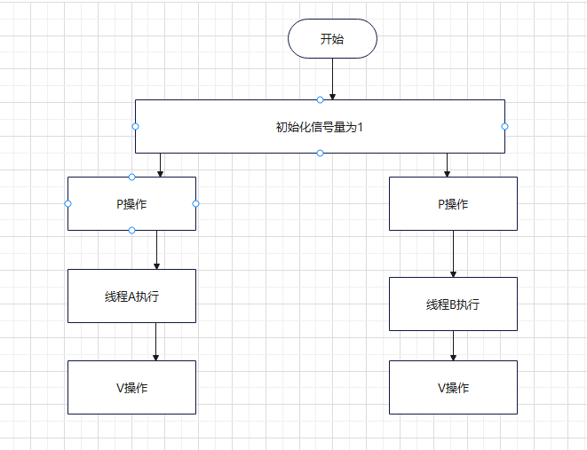


2.若用于同步操作,往往会设置多个信号量,并且安排不同的初始值,来实现它们之间的执行顺序.

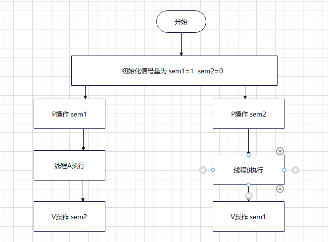

### 7.4.1 信号量的操作

####   信号量的初始化sem_init

~~~c
      #include <semaphore.h>

       int sem_init(sem_t *sem, int pshared, unsigned int value);
								是否在线程间或者进程间共享
       sem_init(信号量名，是否线程/进程共享0/1，初始值)
功能: 初始化一个信号量
参数 : sem :指定的信号量
pshared :是否在线程间或者进程间共享
     0  线程间共享
     1  进程间共享
value : 信号量的初始值
返回值 :
   成功:  0
   失败:  -1
       
~~~

####  信号量P操作sem_wait

 ~~~c
 #include <semaphore.h>

 int sem_wait(sem_t *sem);//失败阻塞
功能: 将信号量的值减1,若信号量的值小于0,此函数会引用调用者阻塞
参数:
    sem :指定的信号量
返回值:
    成功   0
    失败  -1
        
 int sem_trywait(sem_t *sem);//失败返回
功能: 将信号量的值减1,若信号量的值小于0,则对信号量的操作失败,函数立即返回.
  参数:
    sem :指定的信号量
返回值:
    成功   0
    失败  -1  

 ~~~

####  信号量V操作sem_post

~~~c
   #include <semaphore.h>

       int sem_post(sem_t *sem);
 功能:  执行V操作,执行一次,信号量的值加1.
   参数:
    sem :指定的信号量
返回值:
    成功   0
    失败  -1  
~~~

#### 获得信号量的计数值sem_getvalue

~~~c
 #include <semaphore.h>

 int sem_getvalue(sem_t *sem, int *sval);
功能:获取sem标识的信号量的值,保存在sval中
参数:
   sem : 信号量的地址
   sval  保存信号量值的地址
   返回值:
    成功   0
    失败  -1  
~~~

#### 信号量的销毁sem_destroy

~~~c
   #include <semaphore.h>

  int sem_destroy(sem_t *sem);
功能: 删除sem标识的信号量
参数: 
   sem :信号量地址
 返回值:
    成功   0
    失败  -1  
~~~

~~~c
#include <stdio.h>
#include <stdlib.h>
#include <pthread.h>
#include <unistd.h>
#include <semaphore.h>
//创建一个信号量
sem_t sem;
void print(char *str){
    //执行p操作
    //由于信号量实现互斥,信号量的初始值为1,则两个线程执行P操作,
    //先执行P操作的线程继续执行,后执行P操作先阻塞等待.
    sem_wait(&sem);
    while(*str){
        putchar(*str);
        fflush(stdout);
        str++;
        sleep(2);

    }
    //第四步:实现V操作
    sem_post(&sem);
}

void *fun1(void *arg){
    char *p1="hello";
    print(p1);

}
void *fun2(void *arg){
    char *p2="world";
    print(p2);
}
int main(){
    //第二步,初始化信号量
    sem_init(&sem,0,1);
      pthread_t t1,t2;
     if(pthread_create(&t1,NULL,fun1,NULL) !=0){
        perror("fail to pthread_create");
        exit(1);
     } 
     if(pthread_create(&t2,NULL,fun2,NULL) !=0){
        perror("fail to pthread_create");
        exit(1);
     } 
     pthread_join(t1,NULL);
     pthread_join(t2,NULL);
     printf("\n");
     sem_destroy(&sem);
     return 0;
}
~~~

~~~c
//轮换执行
#include <stdio.h>
#include <stdlib.h>
#include <pthread.h>
#include <unistd.h>
#include <semaphore.h>
//创建一个信号量
sem_t sem_p,sem_v;
char c='a';

void *fun1(void *arg){
  
   while(1){
    sem_wait(&sem_v);   
    c++;
    sleep(1);
    sem_post(&sem_p);
   }

}
void *fun2(void *arg){
  
    while(1){
     sem_wait(&sem_p);
     printf("%c",c);
     fflush(stdout);
     sleep(1);
     sem_post(&sem_v);
    }
}
int main(){
    //第二步,初始化信号量
     sem_init(&sem_v,0,0);//初始值为0
     sem_init(&sem_p,0,1);//初始值为1
      pthread_t t1,t2;
     if(pthread_create(&t1,NULL,fun1,NULL) !=0){
        perror("fail to pthread_create");
        exit(1);
     } 
     if(pthread_create(&t2,NULL,fun2,NULL) !=0){
        perror("fail to pthread_create");
        exit(1);
     } 
     pthread_join(t1,NULL);
     pthread_join(t2,NULL);
     printf("\n");
     sem_destroy(&sem_v);
     sem_destroy(&sem_p);
     return 0;
}
~~~


# 八.网络编程基础

**计算机网络的世界语 -- TCP/IP协议** ---http协议

到现在为止，只要是能够通信的机器，能够上网的机器，一定用的就是tcp/ip协议族 

## **一、TCP/IP协议简介** (http协议)

为了减少协议设计的复杂性，大多数网络模型均采用分层的方式来组织 

每一层利用下一层提供的服务来为上一层提供服务 

本层服务的实现细节对上层屏蔽 

### **8.1 分层结构** 

为了能够实现不同类型的计算机和不同类型的操作系统之间进行通信，引入了分层的概念 

最早的分层体系结构是OSI开放系统互联模型，是由国际化标准组织（ISO）指定的，由于 

OSI过于复杂，所以到现在为止也没有适用，而使用的是TCP/IP协议族 

OSI一共分为7层，TCP/IP协议族一共四层，虽然TCP/IP协议族层次少，但是却干了OSI7层 

所有任务

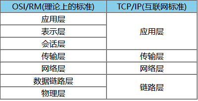

应用层：应用程序间沟通的层 

​	例如：FTP、Telnet、HTTP等 

传输层：提供进程间的数据传送服务，负责传送数据，提供应用程序端到端的逻辑通信 

​	例如：TCP、UDP 

网络层：提供基本的数据封包传送功能，最大可能的让每个数据包都能够到达目的主机 

​	例如：IP、ICMP等 

链路层：负责数据帧的发送和接收 

每层完成自己的任务，最终通过不同层次的处理完成数据的收发

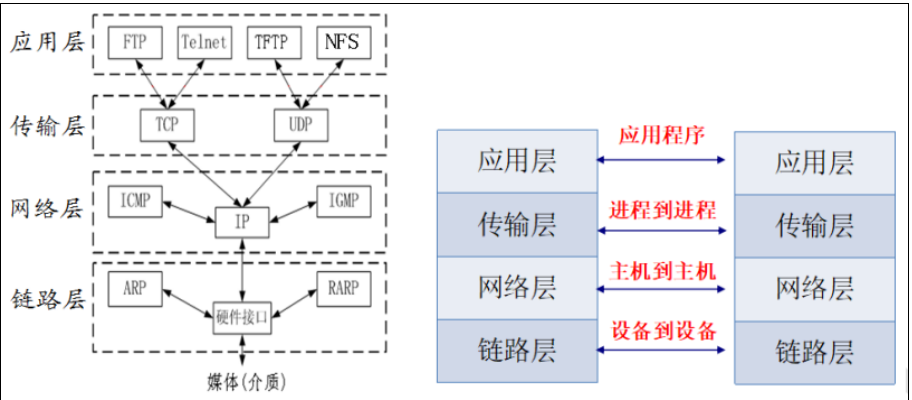


### **8.2 IP协议简介** （不可靠无连接）

IP协议也称之为网际协议 

特指为实现在一个相互连接的网络系统上从源地址到目的地传输数据包（互联网数据包）所提供必要功能的协议 

特点： 

不可靠：它不能保证IP数据包能成功地到达它的目的地，仅提供尽力而为的传输服务 

无连接：IP并不维护任何关于后续数据包的状态信息。每个数据包的处理是相互独立的。IP数据包可以不按发送顺序接收 

IP数据包中含有发送它主机的IP地址（源地址）和接收它主机的IP地址（目的地址） 

### **8.3 TCP协议简介** （序号和确认可靠）

TCP协议，传输控制协议 

TCP是一种面向连接的**,**可靠的传输层通信协议 

功能： 

提供不同主机上的进程间通信 

特点 

1、建立链接->使用链接->释放链接（虚电路） 

2、TCP数据包中包含序号和确认序号 

3、对包进行排序并检错，而损坏的包可以被重传 

服务对象 

需要高度可靠性且面向连接的服务 

如HTTP、FTP、SMTP等


### **8.4 UDP协议简介** （无连接）

UDP协议，用户数据报协议 

UDP是一种面向无连接的传输层通信协议 

功能： 

提供不同主机上的进程间通信 

特点 

1、发送数据之前不需要建立链接 

2、不对数据包的顺序进行检查 

3、没有错误检测和重传机制 

服务对象 

主要用于“查询—应答”的服务 

如：NFS、NTP、DNS等 

## **二、MAC地址、IP地址、Netmask、端口** 

### **8.5 mac地址** 

#### **8.5.1 网卡** 

又称为网络适配器或网络接口卡NIC，但是现在更多的人愿意使用更为简单的名称“网卡” 

通过网卡能够使不同的计算机之间连接，从而完成数据通信等功能 

#### **8.5.2 mac地址** 

每一个网卡在出厂时，都会给分配一个编号，这个编号就称之为mac地址 

MAC地址,用于标识网络设备,类似于身份证号，且理论上全球唯一 

**组成：**以太网内的MAC地址是一个48bit的值，通常人为识别时是通过16进制数来识别的， 

以两个十六进制数为一组，一共分为6组，每组之间通过:隔开，前三组称之为厂商ID， 

后三组称之为设备ID 

如何查询ubuntu的mac地址：

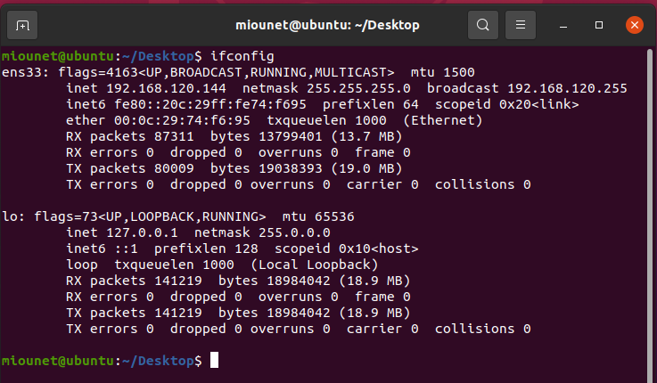

如何查询windows的mac地址鼠标右键点击计算机右下角电脑图标，选择网络和共享中心，左边选择更改适配器设置，找 

到自己联网的图标，双击打开，点击详细信息，即可找到对应的mac地址

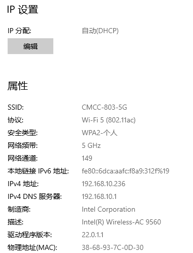

### **8.6 IP地址** 

IP地址是一种Internet上的主机编址方式，也称为网际协议地址 

IP地址是任意一台主机在网络中的唯一标识 

#### **8.6.1 IP地址的分类** 

ipv4，占32位 

ipv6，占128位 

#### **8.6.2 IPV4地址的组成** 

ipv4一般使用点分十进制字符串来标识，比如192.168.3.103 

使用32bit,由{网络ID，主机ID}两部分组成 

子网ID:IP地址中由子网掩码中1覆盖的连续位 

主机ID:IP地址中由子网掩码中0覆盖的连续位

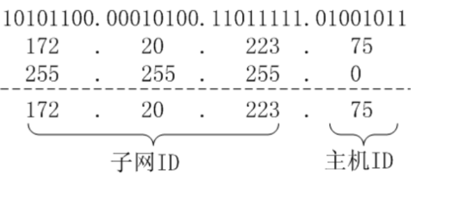

#### **8.6.3 ip地址特点** 

子网ID不同的网络不能直接通信，如果要通信则需要路由器转发 

主机ID全为0的IP地址表示网段地址 

主机ID全为1的IP地址表示该网段的广播地址 

例如： 

192.168.3.10和192.168.3.111可以直接通信 

如果192.168.3.x网段而言，192.168.3.0表示网段，192.168.3.255表示广播地址 

#### **8.6.4 ipv4地址的分类（依据前八位来进行区分）** 

A类地址：默认8bit子网ID,第一位为0，前八位00000000 - 01111111,范围0.x.x.x - 

127.x.x.x 

B类地址：默认16bit子网ID,前两位为10，前八位10000000 - 10111111,范围 

128.x.x.x-191.x.x.x 

C类地址：默认24bit子网ID,前三位为110,前八位11000000 - 11011111,范围 

192.x.x.x-223.x.x.x 

D类地址：前四位为1110,组播地址，前八位11100000-11101111，范围224.x.x.x- 

239.x.x.x 

E类地址: 前五位为11110,保留为今后使用，前八位11110000-11111111，范围 

240.x.x.x-255.x.x.x 

A,B,C三类地址是最常用的 

#### **8.6.5 私有ip地址** 

公有IP（可直接连接Internet） 

经由InterNIC所统一规划的IP 

私有IP（不可直接连接Internet ） 

主要用于局域网络内的主机联机规划

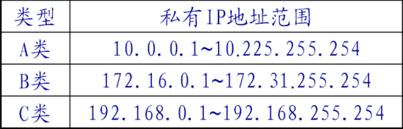

#### **8.6.6 回环ip地址** 

通常 127.0.0.1 称为回环地址功能 

主要是测试本机的网络配置，能ping通127.0.0.1说 

明本机的网卡和IP协议安装都没有问题 

注意 

127.0.0.1~127.255.255.254中的任何地址都将回环到本地主机中 

不属于任何一个有类别地址类,它代表设备的本地虚拟接口 

#### **8.6.7 查询ip一直的命令** 

在ubuntu中  ifconfig

在windows中 ipconfig

### **8.7 子网掩码** 

子网掩码（subnet mask）又叫网络掩码、地址掩码是一个32bit由1和0组成的数值，并且 

1和0分别连续 

**作用** 

指明IP地址中哪些位标识的是主机所在的子网以及哪些位标识的是主机号 

**特点** 

必须结合IP地址一起使用，不能单独存在 

IP地址中由子网掩码中1覆盖的连续位为子网ID,其余为主机ID 

**子网掩码的表现形式** 

192.168.220.0/255.255.255.0 

192.168.220.0/24(11111111  11111111  11111111  00000000)

**默认的子网掩码** 

A类ip地址的默认子网掩码为255.0.0.0 

B类ip地址的默认子网掩码为255.255.0.0 

C类ip地址的默认子网掩码为255.255.255.0

### **8.8 端口** 

#### **8.8.1 端口概述** 

TCP/IP协议采用端口标识通信的进程 

用于区分一个系统里的多个进程 

**特点** 

1、对于同一个端口，在不同系统中对应着不同的进程

2、对于同一个系统，一个端口只能被一个进程拥有 

3、一个进程拥有一个端口后，传输层送到该端口的数据全部被该进程接收，同样，进 

程送交传输层的数据也通过该端口被送出 

#### **8.8.2 端口号** 

类似pid标识一个进程；在网络程序中，用端口号（port）来标识一个运行的网络程序 

**特点** 

1、端口号是无符号短整型的类型 

2、每个端口都拥有一个端口号 

3、TCP、UDP维护各自独立的端口号 

4、网络应用程序,至少要占用一个端口号,也可以占有多个端口号 

**知名端口（1~1023）** 

由互联网数字分配机构(IANA)根据用户需要进行统一分配 

例如：FTP—21，HTTP—80等 

服务器通常使用的范围; 

若强制使用,须加root特权 

**动态端口（1024~65535）** 

应用程序通常使用的范围 

一般我们可以使用的端口号就是在这个范围，比如6666、7777、8888、9999、 

10000、10001 

**注意** 

端口号类似于进程号，同一时刻只能标志一个进程 

可以重复使用

# 九、网络编程初步

## **一、编程准备-字节序、地址转换** 

### **1.1 字节序概述** 

**字节序概念** 

是指多字节数据的存储顺序 

**分类** 

小端格式:将低位字节数据存储在低地址 

大端格式:将高位字节数据存储在低地址 

**注意** 

LSB：低地址 

MSB：高地址 

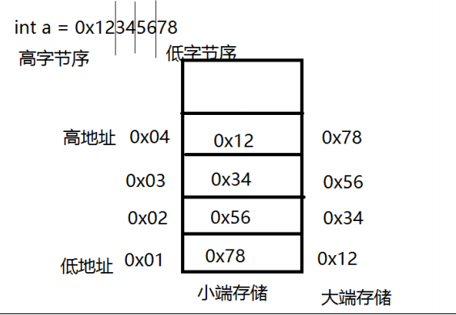

**如何判断当前系统的字节序：**

~~~c
#include <stdio.h>
union un
{
    int a;
    char b;
};
int main(){

     union un mynu;
     mynu.a=0x12345678;
     printf("a======%#x\n",mynu.a);
     printf("b======%#x\n",mynu.b);
     if(mynu.b==0x78){
        printf("小端存储\n");
     }
     else{
        printf("大端存储\n");
     }

    return 0;
}

~~~

### **1.2 字节序转换函数** 

1、网络协议指定了通讯字节序—大端 

2、只有在多字节数据处理时才需要考虑字节序 

3、运行在同一台计算机上的进程相互通信时,一般不用考虑字节序 

4、异构计算机之间通讯，需要转换自己的字节序为网络字节序 

在需要字节序转换的时候一般调用特定字节序转换函数 

~~~c
host ‐‐> network
2 1 ‐‐ htonl
3 #include <arpa/inet.h>
4 uint32_t htonl(uint32_t hostint32);
5 功能:
6 将32位主机字节序数据转换成网络字节序数据
7 参数：
8 hostint32：待转换的32位主机字节序数据
9 返回值：
10 成功：返回网络字节序的值
11
12 2 ‐‐ htons
13 #include <arpa/inet.h>
14 uint16_t htons(uint16_t hostint16);
15 功能：
16 将16位主机字节序数据转换成网络字节序数据
17 参数：
18 uint16_t：unsigned short int
19 hostint16：待转换的16位主机字节序数据
20 返回值：
21 成功：返回网络字节序的值
22
23 network ‐‐> host
24 3 ‐‐ ntohl
25 #include <arpa/inet.h>
26 uint32_t ntohl(uint32_t netint32);
27 功能：
28 将32位网络字节序数据转换成主机字节序数据
29 参数：
30 uint32_t： unsigned int
31 netint32：待转换的32位网络字节序数据
32 返回值：
33 成功：返回主机字节序的值
34
35 4 ‐‐ ntohs
36 #include <arpa/inet.h>
37 uint16_t ntohs(uint16_t netint16);
38 功能：
39 将16位网络字节序数据转换成主机字节序数据
40 参数：
41 uint16_t： unsigned short int
42 netint16：待转换的16位网络字节序数据
43 返回值：
44 成功：返回主机字节序的值
~~~

~~~c
#include <stdio.h>
#include <arpa/inet.h>
int main(){
    
       int x=0x12345678;
       short y=0x1234;
       printf("%#x\n",htonl(x));
       printf("%#x\n",htons(y));


    return 0;
}
~~~

### **1.3 地址转换函数**  p点分十进制/n无符号整数

人为识别的ip地址是点分十进制的字符串形式，但是计算机或者网络中识别的ip地址是整形 

数据，所以需要转化   把IP地址字符串192.168.10.236 转换成整型数据. 

#### **1.3.1 inet_pton() 点分十进制转整型数据**

~~~c
1 字符串ip地址转整型数据
2 #include <arpa/inet.h>
3 int inet_pton(int family,const char *strptr, void *addrptr);
4 功能：
5 将点分十进制数串转换成32位无符号整数
6 参数：
7 family 协议族
    8 AF_INET IPV4网络协议
    9 AF_INET6 IPV6网络协议
10 strptr 点分十进制数串
11 addrptr 32位无符号整数的地址
12 返回值：
13 成功返回1
14 失败返回其它
~~~

~~~c
#include <stdio.h>
#include <arpa/inet.h>
int main(){

   char ip_str[]="192.168.10.236";
   unsigned int ip_int=0;
   unsigned char *ip_p=NULL;
   inet_pton(AF_INET,ip_str,&ip_int);
   printf("ip_int====%d\n",ip_int);

   ip_p=(char *)&ip_int;
   printf("int_ip===%d,%d,%d,%d\n",*ip_p,*(ip_p+1),*(ip_p+2),*(ip_p+3));
   return 0;

}
~~~

#### **1.3.2 inet_ntop()**整形转换成点分十进制

~~~c
整型数据转字符串格式ip地址
2 #include <arpa/inet.h>
3 const char *inet_ntop(int family, const void *addrptr,
4 char *strptr, size_t len);
5 功能：
6 将32位无符号整数转换成点分十进制数串
7 参数：
8 family 协议族
9 addrptr 32位无符号整数
10 strptr 点分十进制数串
11 len strptr缓存区长度
12 len的宏定义
13 #define INET_ADDRSTRLEN 16 //for ipv4
14 #define INET6_ADDRSTRLEN 46 //for ipv6
15 返回值：
16 成功:则返回字符串的首地址
17 失败:返回NULL
~~~

~~~c
#include <stdio.h>
#include <arpa/inet.h>
int main(){

    unsigned char ip_int[]={192,168,10,236};
    char ip_str[16]="";
    inet_ntop(AF_INET,&ip_int,ip_str,16);
    printf("ip_str====%s\n",ip_str);
    return 0;

}
~~~

#### **1.3.3 inet_addr()和inet_ntoa()** ipv4点分十进制转整/整转点分十进制a

这两个函数只能用在ipv4地址的转换

~~~c
1 #include <sys/socket.h>
2 #include <netinet/in.h>
3 #include <arpa/inet.h>
4
5 in_addr_t inet_addr(const char *cp);
6 功能：将点分十进制ip地址转化为整形数据
7 参数：
8 cp：点分十进制的IP地址
9 返回值：
10 成功：整形数据
11
12 char *inet_ntoa(struct in_addr in);
13 功能：将整形数据转化为点分十进制的ip地址
14 参数：
15 in：保存ip地址的结构体
16 返回值：
17 成功：点分十进制的IP地址
~~~

## **二、UDP介绍、编程流程** 

### **2.1 UDP概述** 

**UDP协议** 

面向无连接的用户数据报协议，在传输数据前不需要先建立连接；目地主机的运输层收到 

UDP报文后，不需要给出任何确认 

**UDP特点** 

1、相比TCP速度稍快些 

2、简单的请求/应答应用程序可以使用UDP 

3、对于海量数据传输不应该使用UDP 

4、**广播和多播应用必须使用UDP** 

**UDP应用** 

DNS(域名解析)、NFS(网络文件系统)、RTP(流媒体)等 

一般语音和视频通话都是使用udp来通信的 

### **2.2 网络编程接口socket** 

**socket作用** 

提供不同主机上的进程之间的通信 

**socket特点** 

1、socket也称“套接字” 

2、是一种文件描述符,代表了一个通信管道的一个端点 

3、类似对文件的操作一样，可以使用read、write、close等函数对socket套接字进行网络 

数据的收取和发送等操作 

4、得到socket套接字（描述符）的方法调用socket() 

**socket分类** 

SOCK_STREAM，流式套接字，用于TCP 

SOCK_DGRAM，**数据报套**接字，用于UDP 

SOCK_RAW，原始套接字，对于其他层次的协议操作时需要使用这个类型 

### **2.3 UDP编程C/S架构**

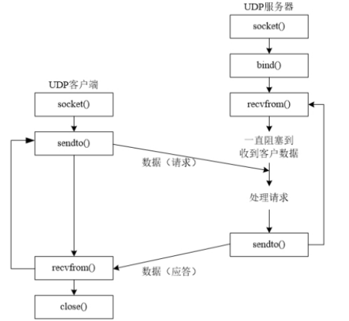

**UDP网络编程流程：** 

服务器： 

创建套接字 socket( ) 

将服务器的ip地址、端口号与套接字进行绑定 bind( ) 

接收数据 recvfrom() 

发送数据 sendto() 

客户端： 

创建套接字 socket() 

发送数据 sendto() 

接收数据 recvfrom() 

关闭套接字 close() 

## **三、UDP编程-创建套接字** 

### **3.1 创建socket套接字**

~~~c
1 #include <sys/types.h>
2 #include <sys/socket.h>
3 int socket(int domain, int type, int protocol);
		int socket(通信协议族，类型，0);//返回文字描述符
4 功能：创建一个套接字，返回一个文件描述符
5 参数：
6 domain：通信域，协议族
    7 AF_UNIX 本地通信
    8 AF_INET ipv4网络协议
    9 AF_INET6 ipv6网络协议
    10 AF_PACKET 底层接口
11 type：套接字的类型
    12 SOCK_STREAM 流式套接字（tcp）
    13 SOCK_DGRAM 数据报套接字（udp）
    14 SOCK_RAW 原始套接字（用于链路层）
15 protocol：附加协议，如果不需要，则设置为0
16 返回值：
17 成功：文件描述符
18 失败：‐1
~~~

**特点：** 

创建套接字时，系统不会分配端口 

创建的套接字默认属性是主动的，即主动发起服务的请求;当作为服务器时，往往需要修改为被动的 

### **3.2 创建UDP套接字**

~~~c
#include <stdio.h>
#include <sys/types.h>         
#include <sys/socket.h>
#include <stdlib.h>
int main(){
   
    int socketfd;
    if((socketfd=socket(AF_INET,SOCK_DGRAM,0))==-1){

       perror("fail to socket...\n");
       exit(1);

    }
    printf("socketfd=====%d\n",socketfd);

    return 0;
}
~~~

## **四、UDP编程-发送、绑定、接收数据** 

### **4.1 IPv4套接字地址结构** 

#### 4.1.1网络编程常用结构体sockaddr_in 定义用

~~~c
#include <netinet/in.h>
1 struct in_addr
2 {
3 in_addr_t s_addr;//ip地址 4字节
4 };
5 struct sockaddr_in
6 {
    sa_family_t 		sin_family;//协议族 2字节
    in_port_t 			sin_port;//端口号 2字节
    struct in_addr 		sin_addr;//ip地址 4字节
    char 				sin_zero[8]//填充，不起什么作用 8字节
11 };
~~~

为了使不同格式地址能被传入套接字函数,地址须要强制转换成通用套接字地址结构，原因是因为不同场合所使用的结构体不一样，但是调用的函数却是同一个，所以定义一个通用结构体，当在指定场合使用时，在根据要求传入指定的结构体即可 

#### 4.1.2通用结构体 sockaddr 传参用

~~~c
#include <netinet/in.h>
1 struct sockaddr
2 {
3 sa_family_t 		sa_family; // 2字节
4 char 				sa_data[14] //14字节
5 };
~~~

###  **4.2 两种地址结构使用场合** 

在定义**源地址和目的地址结构**的时候，选用struct sockaddr_in; 

```c
struct sockaddr_in my_addr; 
```

当调用**编程接口函数**，且该函数需要**传入地址结构时**需要用struct sockaddr进行强制转换 

```c
bind(sockfd,(struct sockaddr*)&my_addr,sizeof(my_addr));
```

### **4.3 发送数据—sendto函数**

~~~c
1 #include <sys/types.h>
2 #include <sys/socket.h>
3 ssize_t sendto(int sockfd, const void *buf, size_t len, int flags,const struct sockaddr *dest_addr, 						socklen_t addrlen);
  ssize_t sendto(返回的文字描述符，数据指针，       长度，     标志位（阻塞与非阻塞），发送结构体对象地址，
                 地址长度);//返回发送的字节数
5 功能：发送数据
6 参数：
7 sockfd：文件描述符，socket的返回值
8 buf：要发送的数据
9 len：buf的长度
10 flags：标志位
    0 阻塞
    MSG_DONTWAIT 非阻塞
13 dest_addr：目的网络信息结构体（需要自己指定要给谁发送）
14 addrlen：dest_addr的长度
15 返回值：
16 成功：发送的字节数
17 失败：‐1
~~~

ubuntu下客户端的代码编写

~~~c
1 #include <stdio.h> //printf
2 #include <stdlib.h> //exit
3 #include <sys/types.h>
4 #include <sys/socket.h> //socket
5 #include <netinet/in.h> //sockaddr_in
6 #include <arpa/inet.h> //htons inet_addr
7 #include <unistd.h> //close
8 #include <string.h>
9
10 #define N 128
11
12 int main(int argc, char const *argv[])
13 {
14 //./a.out 192.168.3.78 8080
15 if(argc < 3)
16 {
17 fprintf(stderr, "Usage：%s ip port\n", argv[0]);
18 exit(1);
19 }
20
21 //第一步：创建套接字
22 int sockfd;
23 if((sockfd = socket(AF_INET, SOCK_DGRAM, 0)) == ‐1)
24 {
25 perror("fail to socket");
26 exit(1);
27 }
28
29 printf("sockfd = %d\n", sockfd);
30
31 //第二步：填充服务器网络信息结构体 sockaddr_in
32 struct sockaddr_in serveraddr;
33 socklen_t addrlen = sizeof(serveraddr);// 地址长度
34
35 serveraddr.sin_family = AF_INET; //协议族，AF_INET：ipv4网络协议
36 serveraddr.sin_addr.s_addr = inet_addr(argv[1]); //ip地址
37 serveraddr.sin_port = htons(atoi(argv[2]));
38
39 //第三步：发送数据
40 char buf[N] = "";
41 while(1)
42 {
43 fgets(buf, N, stdin);
44 buf[strlen(buf) ‐ 1] = '\0'; //把buf字符串中的\n转化为\0
    
45 //const struct sockaddr *dest_addr, socklen_t addrlen);
46 if(sendto(sockfd, buf, N, 0, (struct sockaddr *)&serveraddr, addrlen) == ‐1)
47 {
48 perror("fail to sendto");
49 exit(1);
50 }
51 }
52
53 //第四步：关闭套接字文件描述符
54 close(sockfd);
55
56 return 0;
57 }
~~~

### **4.5 绑定--bind函数** (socket文件描述符和IP/port)

UDP网络程序想要收取数据需什么条件？ 

确定的ip地址 const struct sockaddr *addr

确定的port号 socklen_t addrlen

接收端 使用bind函数，来完成地址结构与socket套接字的绑定，这样ip、port就固定了 

发送端 在sendto函数中指定接收端的ip、port，就可以发送数据了由于服务器是被动的，客户端是主动的，所以一般先运行服务器，后运行客户端，所以服务器需要固定自己的信息（ip地址和端口号），这样客户端才可以找到服务器并与之通信，但是客户端一般不需要bind绑定，因为系统会自动给客户端分配ip地址和端口号 

~~~c
1 #include <sys/types.h>
2 #include <sys/socket.h>
3 int bind(int sockfd, const struct sockaddr *addr, socklen_t addrlen);
	bind(sockfd, 网络信息结构体的地址, 地址长度)
4 功能：将套接字与网络信息结构体绑定
5 参数：
	sockfd：文件描述符，socket的返回值
	addr：网络信息结构体 sockaddr_in
		通用结构体（一般不用）struct sockaddr
11 #include <netinet/in.h>
12 struct sockaddr_in
13 addrlen：addr的长度
14 返回值：
15 成功：0
16 失败：‐1
~~~

### **4.6 bind示例**

~~~c
1 //第二步：将服务器的网络信息结构体绑定前进行填充
2 struct sockaddr_in serveraddr;
3 serveraddr.sin_family = AF_INET;
4 serveraddr.sin_addr.s_addr = inet_addr(argv[1]);
5 serveraddr.sin_port = htons(atoi(argv[2]));
6
7 //第三步：将网络信息结构体与套接字绑定
8 if(bind(sockfd, (struct sockaddr *)&serveraddr, sizeof(serveraddr)) == ‐1)
9 {
    perror("fail to bind");
    exit(1);
12 }
~~~

### **4.7 接收数据—recvfrom 函数**

~~~c
1 #include <sys/types.h>
2 #include <sys/socket.h>
3
4 ssize_t recvfrom(int sockfd, void *buf, size_t len, int flags,struct sockaddr *src_addr, socklen_t *addrlen);
		recvfrom(文件描述符，接受数据指针，数据长度， 标志0，信息结构体（自动），结构体长度)
6 功能：接收数据
7 参数：
    sockfd：文件描述符，socket的返回值
    buf：保存接收的数据
    len：buf的长度
    flags：标志位
        0 阻塞
        MSG_DONTWAIT 非阻塞
    src_addr：源的网络信息结构体（自动填充，定义变量传参即可）
    addrlen：src_addr的长度
16 返回值：
17 成功：接收的字节数
18 失败：‐1
~~~

~~~c
1 #include <stdio.h> //printf
2 #include <stdlib.h> //exit
3 #include <sys/types.h>
4 #include <sys/socket.h> //socket
5 #include <netinet/in.h> //sockaddr_in
6 #include <arpa/inet.h> //htons inet_addr
7 #include <unistd.h> //close
8 #include <string.h>
9
10 #define N 128
11
12 int main(int argc, char const *argv[])
13 {
14 if(argc < 3)
15 {
16 fprintf(stderr, "Usage: %s ip port\n", argv[0]);
17 exit(1);
18 }
19
20 //第一步：创建套接字
21 int sockfd;
22 if((sockfd = socket(AF_INET, SOCK_DGRAM, 0)) == ‐1)
23 {
	perror("fail to socket");
	exit(1);
26 }
27
28 //第二步：将服务器的网络信息结构体绑定前进行填充
29 struct sockaddr_in serveraddr;
30 serveraddr.sin_family = AF_INET;
31 serveraddr.sin_addr.s_addr = inet_addr(argv[1]); //192.168.3.103
32 serveraddr.sin_port = htons(atoi(argv[2])); //9999
33
34 //第三步：将网络信息结构体与套接字绑定
35 if(bind(sockfd, (struct sockaddr *)&serveraddr, sizeof(serveraddr)) == ‐1)
36 {
37 perror("fail to bind");
38 exit(1);
39 }
40
41 //接收数据
42 char buf[N] = "";
43 struct sockaddr_in clientaddr;
44 socklen_t addrlen = sizeof(struct sockaddr_in);
45 while(1)
46 {
    if(recvfrom(sockfd, buf, N, 0, (struct sockaddr *)&clientaddr, &addrlen) == ‐1)
    {
        perror("fail to recvfrom");
        exit(1);
    }
51 }
52
53 //打印数据
54 //打印客户端的ip地址和端口号
55 printf("ip:%s, port:%d\n", inet_ntoa(clientaddr.sin_addr), ntohs(clientaddr.sin_port));
56 //打印接收到数据
57 printf("from client: %s\n", buf);
58 }
59
60 return 0;
61 }
62
~~~

## **五、UDP编程-client、server** 

### **5.1 C/S架构回顾**

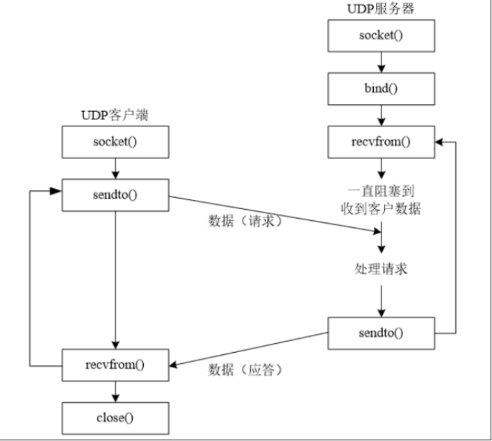

### **5.2 UDP客户端注意点** 

1、本地IP、本地端口（我是谁） 

2、目的IP、目的端口（发给谁） 

3、在客户端的代码中，我们只设置了目的IP、目的端口客户端的本地ip、本地port是我们调用sendto的时候linux系统底层自动给客户端分配的；分配端口的方式为随机分配，即每次运行系统给的port不一样 

~~~c
 //udp客户端的实现
 #include <stdio.h> //printf
#include <stdlib.h> //exit
#include <sys/types.h>
#include <sys/socket.h> //socket
#include <netinet/in.h> //sockaddr_in
#include <arpa/inet.h> //htons inet_addr
#include <unistd.h> //close
#include <string.h>

 int main(int argc, char const *argv[])
{
if(argc < 3)
 {
        fprintf(stderr, "Usage: %s <ip> <port>\n", argv[0]);
        exit(1);
 }

 int sockfd; //文件描述符
 struct sockaddr_in serveraddr; //服务器网络信息结构体
 socklen_t addrlen = sizeof(serveraddr);

//第一步：创建套接字
 if((sockfd = socket(AF_INET, SOCK_DGRAM, 0)) < 0)
 {
     perror("fail to socket");
     exit(1);
 }

 //客户端自己指定自己的ip地址和端口号，一般不需要，系统会自动分配
 #if 0
 struct sockaddr_in clientaddr;
 clientaddr.sin_family = AF_INET;
 clientaddr.sin_addr.s_addr = inet_addr(argv[3]); //客户端的ip地址
clientaddr.sin_port = htons(atoi(argv[4])); //客户端的端口号
 if(bind(sockfd, (struct sockaddr *)&clientaddr, addrlen) < 0)
{
    perror("fail to bind");
 }
 #endif

 //第二步：填充服务器网络信息结构体
 //inet_addr：将点分十进制字符串ip地址转化为整形数据
 //htons：将主机字节序转化为网络字节序
 //atoi：将数字型字符串转化为整形数据
serveraddr.sin_family = AF_INET;
serveraddr.sin_addr.s_addr = inet_addr(argv[1]);
serveraddr.sin_port = htons(atoi(argv[2]));

 //第三步：进行通信
 char buf[32] = "";
 while(1)
 {
     fgets(buf, sizeof(buf), stdin);
    buf[strlen(buf)-1] = '\0';

 if(sendto(sockfd, buf, sizeof(buf), 0, (struct sockaddr *)&serveraddr, sizeof(serveraddr)) < 0)
 {
     perror("fail to sendto");
     exit(1);
 }

 char text[32] = "";
if(recvfrom(sockfd, text, sizeof(text), 0, (struct sockaddr *)&serveraddr, &addrlen) < 0)
{
    perror("fail to recvfrom");
     exit(1);
 }
    printf("from server: %s\n", text);
 }
 //第四步：关闭文件描述符
 close(sockfd);

 return 0;
}
~~~

### **5.3 UDP服务器注意点** 

1、服务器之所以要bind是因为它的本地port需要是固定，而不是随机的 

2、服务器也可以主动地给客户端发送数据 

3、客户端也可以用bind，这样客户端的本地端口就是固定的了，但一般不这样做

~~~c
#include <stdio.h> //printf
 #include <stdlib.h> //exit
#include <sys/types.h>
#include <sys/socket.h> //socket
#include <netinet/in.h> //sockaddr_in
 #include <arpa/inet.h> //htons inet_addr
#include <unistd.h> //close
 #include <string.h>

int main(int argc, char const *argv[])
 {
if(argc < 3)
 {
fprintf(stderr, "Usage: %s <ip> <port>\n", argv[0]);
exit(1);
 }

int sockfd; //文件描述符
 struct sockaddr_in serveraddr; //服务器网络信息结构体
 socklen_t addrlen = sizeof(serveraddr);

 //第一步：创建套接字
 if((sockfd = socket(AF_INET, SOCK_DGRAM, 0)) < 0)
 {
 perror("fail to socket");
 exit(1);
 }

//第二步：填充服务器网络信息结构体
//inet_addr：将点分十进制字符串ip地址转化为整形数据
//htons：将主机字节序转化为网络字节序
 //atoi：将数字型字符串转化为整形数据
 serveraddr.sin_family = AF_INET;
serveraddr.sin_addr.s_addr = inet_addr(argv[1]);
serveraddr.sin_port = htons(atoi(argv[2]));

//第三步：将套接字与服务器网络信息结构体绑定
if(bind(sockfd, (struct sockaddr *)&serveraddr, addrlen) < 0)
{
perror("fail to bind");
 exit(1);
 }

while(1)
{
//第四步：进行通信
 char text[32] = "";
 struct sockaddr_in clientaddr;
 if(recvfrom(sockfd, text, sizeof(text), 0, (struct sockaddr *)&clientaddr, &addrlen) < 0)
{
 perror("fail to recvfrom");
exit(1);
}
 printf("[%s ‐ %d]: %s\n", inet_ntoa(clientaddr.sin_addr), ntohs(clientaddr.sin_port),text);

 strcat(text, " *_*");

 if(sendto(sockfd, text, sizeof(text), 0, (struct sockaddr *)&clientaddr, addrlen) < 0)
{
 perror("fail to sendto");
exit(1);
 }
 }

 //第四步：关闭文件描述符
 close(sockfd);

return 0;
 }
~~~

# 十、网络编程过程

## **一、TCP介绍、编程流程** 

**TCP回顾** 

1、面向连接的流式协议;可靠、出错重传、且每收到一个数据都要给出相应的确认 

2、通信之前需要建立链接 

3、服务器被动链接，客户端是主动链接

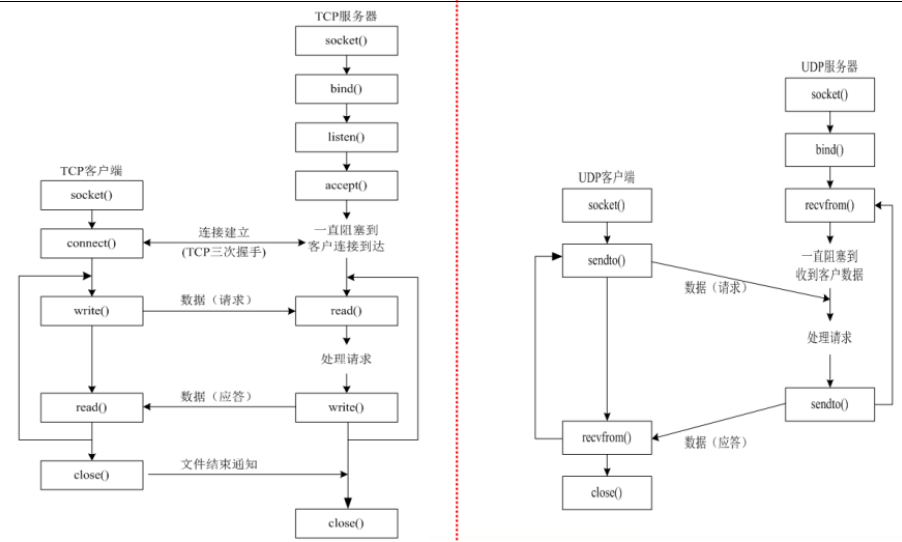

**TCP编程流程** 

服务器： 

- 创建套接字 socket() 

- 将套接字与服务器网络信息结构体绑定 bind() 

- 将套接字设置为监听状态 listen() 

- 阻塞等待客户端的连接请求 accept() 

- 进行通信 recv()/send() 

- 关闭套接字 close() 


客户端： 

- 创建套接字 socket() 

- 发送客户端连接请求 connect() 

- 进行通信 send()/recv() 

- 关闭套接字 close()


## **二、TCP编程-socket**

~~~c
1 #include <sys/types.h>
2 #include <sys/socket.h>
3 int socket(int domain, int type, int protocol);
		socket(通信域，套接字类型，0 )//同tcp
4 功能：创建一个套接字，返回一个文件描述符
5 参数：
6 domain：通信域，协议族
   	AF_UNIX 本地通信
    AF_INET ipv4网络协议
    AF_INET6 ipv6网络协议
    AF_PACKET 底层接口
11 type：套接字的类型
    SOCK_STREAM 流式套接字（tcp）
    SOCK_DGRAM 数据报套接字（udp）
    SOCK_RAW 原始套接字（用于链路层）
15 protocol：附加协议，如果不需要，则设置为0
16 返回值：
    成功：文件描述符
   	失败：‐1
~~~

```c
#include <
int setsockopt(int sockfd, int level, int optname, const void *optval, socklen_t optlen);
	参数：
        sockfd：指定要设置选项的套接字文件描述符。
        level：指定选项的协议层，通常为SOL_SOCKET表示套接字级选项。
        	SOL_SOCKET（通用套接字选项）
        		SO_REUSEADDR：允许重用处于TIME_WAIT状态的套接字地址。端口复用。
        			0：表示关闭地址重用功能。当端口被占用时，bind()将会失败。
					1：表示开启地址重用功能。即使端口被占用，也可以绑定成功，但需要谨慎使用，避免出现意外情况。
				SO_KEEPALIVE：启用或禁用TCP连接的保持活动功能。长时间未收到数据时，发送保持活动探测包检测连接。
            IPPROTO_IP（IP层选项）
            IPPROTO_TCP（TCP层选项）
            IPPROTO_IPV6（IPv6层选项）
        optname：指定要设置的选项名，比如SO_REUSEADDR、SO_KEEPALIVE等。
        optval：指向存有选项值的缓冲区的指针。
        optlen：指定选项值的长度。

```


~~~c
#include <stdio.h> //printf
#include <stdlib.h> //exit
#include <sys/types.h>
#include <sys/socket.h> //socket
#include <netinet/in.h> //sockaddr_in
#include <arpa/inet.h> //htons inet_addr
#include <unistd.h> //close
#include <string.h>
 int main(){

     int socketfd;
     if((socketfd=socket(AF_INET,SOCK_STREAM,0))==-1){
        perror("fail to socket");
        exit(1);
     }
     printf("socketfd====%d\n",socketfd);
     

 }
~~~

## **三、TCP客户端-connect、send、recv** 

### **3.1 connect函数**

~~~c
1 #include <sys/types.h> /* See NOTES */
2 #include <sys/socket.h>
3 int connect(int sockfd, const struct sockaddr *addr, socklen_t addrlen);
		connect(sockfd, 网络信息结构体， 结构体长度)
4 功能：给服务器发送客户端的连接请求
5 参数：
6 sockfd：文件描述符，socket函数的返回值
7 addr：要连接的服务器的网络信息结构体（需要自己设置）
8 addrlen：add的长度
9 返回值：
10 成功：0
11 失败：‐1
~~~

1、connect建立连接之后不会产生新的套接字 

2、连接成功后才可以开始传输TCP数据 

3、头文件：#include <sys/socket.h>

### **3.2 send函数**

~~~c
1 #include <sys/types.h>
2 #include <sys/socket.h>
3 ssize_t send(int sockfd, const void *buf, size_t len, int flags);
		send(套接字， 发送数据指针， 数据长度， 标志0)
4 功能：发送数据
5 参数：
6 sockfd：文件描述符
    客户端：socket函数的返回值
    服务器：accept函数的返回值
9 buf：发送的数据
10 len：buf的长度
11 flags：标志位
    0 阻塞
    MSG_DONTWAIT 非阻塞
14 返回值：
15 成功：发送的字节数
16 失败：‐1
~~~

**注意：** **不能用TCP协议发送0长度的数据包**

### **3.3 recv函数**

~~~c
1 #include <sys/types.h>
2 #include <sys/socket.h>
3 ssize_t recv(int sockfd, void *buf, size_t len, int flags);
			recv(sockfd, 存储字符串指针， 指针长度， 标志位0)
4 功能：接收数据
5 参数：
sockfd：文件描述符
    客户端：socket函数的返回值
    服务器：accept函数的返回值
buf：保存接收到的数据
len：buf的长度
flags：标志位
    0 阻塞
    MSG_DONTWAIT 非阻塞
14 返回值：
15 成功：接收的字节数
16 失败：‐1
17 如果发送端关闭文件描述符或者关闭进程，则recv函数会返回0
~~~

### **3.4 客户端code** 

使用windows下的网络调试助手作为服务器

客户端的程序

~~~c
#include <stdio.h> //printf
 #include <stdlib.h> //exit
#include <sys/types.h>
#include <sys/socket.h> //socket
#include <netinet/in.h> //sockaddr_in
 #include <arpa/inet.h> //htons inet_addr
#include <unistd.h> //close
 #include <string.h>
 int main(int argc,char const *argv[]){
    if(argc < 3)
     {
    fprintf(stderr, "Usage: %s <ip> <port>\n", argv[0]);
    exit(1);
    }
     int socketfd;
     if((socketfd=socket(AF_INET,SOCK_STREAM,0))==-1){
        perror("fail to socket");
        exit(1);
     }
   //  printf("socketfd====%d\n",socketfd);
     struct sockaddr_in serveraddr; //服务器网络信息结构体
     socklen_t addrlen = sizeof(serveraddr);
     serveraddr.sin_family = AF_INET;
     serveraddr.sin_addr.s_addr = inet_addr(argv[1]);
     serveraddr.sin_port = htons(atoi(argv[2]));
    
     if(connect(socketfd, (struct sockaddr *) &serveraddr,addrlen)==-1){
        perror("fail to connect");
        exit(1);
     }
    //发送数据
    char buffer[128]="";
    fgets(buffer,128,stdin);
    buffer[strlen(buffer)-1]='\0';
    if(send(socketfd,buffer,128,0)==-1){
        perror("fail to send...");
        exit(1);
    }
    //接收数据
    char content[128]="";
    if(recv(socketfd,content,128,0)==-1){
        perror("fail to recv");
        exit(1);
    }
    printf("from server: %s\n",content);
    close(socketfd);
    return 0;
 }
~~~

## **四、TCP服务器-bind、listen、accept** 

### **4.1 做为TCP服务器需要具备的条件** 

1、具备一个可以确知的地址 

2、让操作系统知道是一个服务器，而不是客户端 

3、等待连接的到来 

对于面向连接的TCP协议来说，连接的建立才真正意味着数据通信的开始 

### **4.2 bind函数**

~~~c
1 #include <sys/types.h>
2 #include <sys/socket.h>
3 int bind(int sockfd, const struct sockaddr *addr, socklen_t addrlen);
	bind(sockfd, 网络结构体， )
4 功能：将套接字与网络信息结构体绑定
5 参数：
6 sockfd：文件描述符，socket的返回值
7 addr：网络信息结构体
    通用结构体（一般不用）
    struct sockaddr
    网络信息结构体 sockaddr_in
    #include <netinet/in.h>
    struct sockaddr_in
13 addrlen：addr的长度
14 返回值：
15 成功：0
16 失败：‐1
~~~

### **4.3 listen函数**

~~~c
1 #include <sys/types.h> /* See NOTES */
2 #include <sys/socket.h>
3 int listen(int sockfd, int backlog);
	listen(sockfd , 允许连接的主机个数)
4 功能：将套接字设置为被动监听状态，这样做之后就可以接收到连接请求
5 参数：
6 sockfd：文件描述符，socket函数返回值
7 backlog：允许通信连接的主机个数，一般设置为5、10
8 返回值：
9 成功：0
10 失败：‐1
~~~

### **4.4 accept函数（等待连接返回文件描述符）**

~~~c
1 #include <sys/types.h> /* See NOTES */
2 #include <sys/socket.h>
3 int accept(int sockfd, struct sockaddr *addr, socklen_t *addrlen);
4 功能：阻塞等待客户端的连接请求
5 参数：
6 sockfd：文件描述符，socket函数的返回值
7 addr：接收到的客户端的信息结构体（自动填充，定义变量即可）
8 addrlen：addr的长度
9 返回值：
10 成功：新的文件描述符（只要有客户端连接，就会产生新的文件描述符，这个新的文件描述符专门与指定的客户端进行通信的）
12 失败：‐1
~~~

### **4.5 TCP服务器例子**

~~~c
#include <stdio.h> //printf
#include <stdlib.h> //exit
#include <sys/types.h>
#include <sys/socket.h> //socket
#include <netinet/in.h> //sockaddr_in
 #include <arpa/inet.h> //htons inet_addr
#include <unistd.h> //close
 #include <string.h>
 int main(int argc,char const *argv[]){
     if(argc < 3)
     {
         fprintf(stderr, "Usage: %s <ip> <port>\n", argv[0]);
         exit(1);
     }
     //第一步,创建套接字
     int socketfd;
     if((socketfd=socket(AF_INET,SOCK_STREAM,0))==-1){
        perror("fail to socket...");
        exit(1);
     }
     // 第二步 将套接字与服务器网络信息结构体绑定(ip,端号)
     struct sockaddr_in serveraddr; //服务器网络信息结构体
     socklen_t addrlen = sizeof(serveraddr);
     serveraddr.sin_family = AF_INET;
     serveraddr.sin_addr.s_addr = inet_addr(argv[1]);
     serveraddr.sin_port = htons(atoi(argv[2]));

    if(bind(socketfd,(struct sockaddr *)&serveraddr,addrlen)==-1){
        perror("fail to bind....");
        exit(1);
    }
    //第三步:将套接字设置为被动监听状态
    if(listen(socketfd,15)==-1){
        perror("fail to listen");
        exit(1);
    }
    //第四步:阻塞等待客户端的链接请求
    //返回客户端文件描述符
    int acceptfd;
    //客户端的IP信息
    struct sockaddr_in clientaddr;
    if((acceptfd=accept(socketfd,(struct sockaddr *)&clientaddr,&addrlen))==-1){
        perror("fail to accept...");
        exit(1);
    }
    //打印连接的客户端的信息
    printf("ip:%s,port:%d\n",inet_ntoa(clientaddr.sin_addr),ntohs(clientaddr.sin_port));
    //第五步:通信
    //接收客户端发送过来的信息
    char buffer[128]="";
    if(recv(acceptfd,buffer,128,0)==-1){
        perror("fail to recv....");

    }
    printf("from client: %s\n",buffer);

    strcat(buffer," *_* ");
    if(send(acceptfd,buffer,128,0)==-1){
        perror("fail to send....");
        exit(1);
    }
    //最后一步:关闭套接字及文件描述符
    close(acceptfd);
    close(socketfd);


 }
~~~

## **五、TCP编程-close、三次握手、四次挥手** 

### **5.1 close关闭套接字** 

1、使用close函数即可关闭套接字 

​	关闭一个代表已连接套接字将导致另一端接收到一个0长度的数据包 

2、做服务器时 

1. 关闭监听套接字将导致服务器无法接收新的连接，但不会影响已经建立的连接 

2. 关闭accept返回的已连接套接字将导致它所代表的连接被关闭，但不会影响服务器的监听 


3、做客户端时 

​	关闭连接就是关闭连接，不意味着其他 

### **5.2 三次握手**   lucy       jack

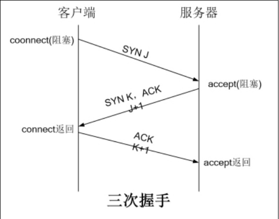

### **5.3 四次挥手**

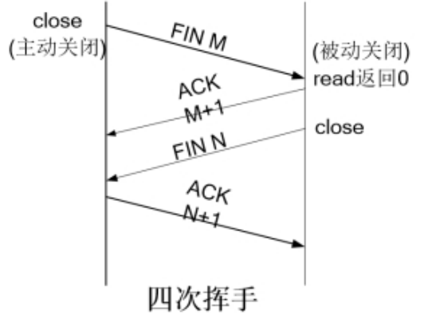

## **六、TCP并发服务器** 

TCP原本不是并发服务器，TCP服务器同一时间只能与一个客户端通信 

### 6.1原始代码： 

#### 6.1.1client.c

~~~c
#include <stdio.h>
#include <stdlib.h>
#include <unistd.h>
#include <sys/types.h>
#include <sys/socket.h>
#include <arpa/inet.h>
#include <netinet/in.h>
#include <string.h>

#define N 128

int main(int argc, char const *argv[])
{
    if(argc < 3)
    {
        fprintf(stderr, "Usage: %s <server_ip> <server_port>\n", argv[0]);
        exit(1);
    }    

    int sockfd;
    struct sockaddr_in serveraddr;

    //第一步：创建套接字
    if((sockfd = socket(AF_INET, SOCK_STREAM, 0)) < 0)
    {
        perror("fail to socket");
        exit(1);
    }

    //第二步：填充服务器网络信息结构体
    serveraddr.sin_family = AF_INET;
    serveraddr.sin_addr.s_addr = inet_addr(argv[1]);
    serveraddr.sin_port = htons(atoi(argv[2]));

    //第三步：发送客户端连接请求
    if(connect(sockfd, (struct sockaddr *)&serveraddr, sizeof(serveraddr)) < 0)
    {
        printf("fail to connect");
        exit(1);
    }

    //第四步：进行通信
    char buf[N] = "";
    while(1)
    {
        fgets(buf, N, stdin);
        buf[strlen(buf) - 1] = '\0';

        if(send(sockfd, buf, N, 0) < 0)
        {
            printf("fail to send");
        }

        if(strncmp(buf, "quit", 4) == 0)
        {
            exit(0);
        }

        if(recv(sockfd, buf, N, 0) < 0)
        {
            printf("fail to recv");
        }

        printf("from server: %s\n", buf);
    }

    //第四步：关闭套接字
    close(sockfd);

    return 0;
}
~~~

#### 6.1.2server.c

~~~c
#include <stdio.h>
#include <stdlib.h>
#include <unistd.h>
#include <sys/types.h>
#include <sys/socket.h>
#include <arpa/inet.h>
#include <netinet/in.h>
#include <string.h>
#include <signal.h>

#define N 128


int main(int argc, char const *argv[])
{
    if(argc < 3)
    {
        fprintf(stderr, "Usage: %s <server_ip> <server_port>\n", argv[0]);
        exit(1);
    }    

    int sockfd, acceptfd;
    struct sockaddr_in serveraddr, clientaddr;
    socklen_t addrlen = sizeof(serveraddr);

    //第一步：创建套接字
    if((sockfd = socket(AF_INET, SOCK_STREAM, 0)) < 0)
    {
        printf("fail to socket");
    }
    
    //将套接字设置为允许重复使用本机地址或者设置为端口复用
    int on = 1;
    // setsockopt(sockfd, )
    if(setsockopt(sockfd, SOL_SOCKET, SO_REUSEADDR, &on, sizeof(on)) < 0)
    {
        printf("fail to setsockopt");
    }

    //第二步：填充服务器网络信息结构体
    serveraddr.sin_family = AF_INET;
    serveraddr.sin_addr.s_addr = inet_addr(argv[1]);
    serveraddr.sin_port = htons(atoi(argv[2]));

    //第三步：将套接字与服务器网络信息结构体绑定
    if(bind(sockfd, (struct sockaddr *)&serveraddr, addrlen) < 0)
    {
        printf("fail to bind");
    }

    //第四步：将套接字设置为被动监听状态
    if(listen(sockfd, 5) < 0)
    {
        printf("fail to listen");
    }

    //第五步：阻塞等待客户端的连接请求
    if((acceptfd = accept(sockfd, (struct sockaddr *)&clientaddr, &addrlen)) < 0)
    {
        printf("fail to accept");
    }

    //打印客户端的信息
    printf("%s -- %d\n", inet_ntoa(clientaddr.sin_addr), ntohs(clientaddr.sin_port));

    //第六步：进行通信
    char buf[N] = "";
    ssize_t bytes;
    while (1)
    {
        //注意：tcp中服务器与客户端通信时，一定要用accept函数的返回值来通信
        if((bytes = recv(acceptfd, buf, N, 0)) < 0)
        {
            printf("fail to recv");
        }
        else if(bytes == 0)
        {
            printf("The client quited\n");
            exit(1);
        }

        if(strncmp(buf, "quit", 4) == 0)
        {
            exit(0);
        }

        printf("from client: %s\n", buf);

        strcat(buf, " ^_^");
        if(send(acceptfd, buf, N, 0) < 0)
        {
            printf("fail to send");
        }
    }
    
    //第七步：关闭套接字
    close(acceptfd);
    close(sockfd);

    return 0;
}
~~~

### 6.2TCP并发

TCP不能实现并发的原因： 

由于TCP服务器端有两个读阻塞函数，accept和recv，两个函数需要先后运行，所以导致运行一个函数的时候另一个函数无法执行，所以无法保证一边连接客户端，一边与其他客户端通信 

如何实现TCP并发服务器：

#### 6.2.1使用多进程实现TCP并发服务器 

~~~c
#include <stdio.h>
#include <stdlib.h>
#include <unistd.h>
#include <sys/types.h>
#include <sys/socket.h>
#include <arpa/inet.h>
#include <netinet/in.h>
#include <string.h>
#include <signal.h>
#include <sys/wait.h>
#include <signal.h>

//使用多进程实现TCP并发服务器

#define N 128

void handler(int sig)
{
    wait(NULL);
}

int main(int argc, char const *argv[])
{
    if(argc < 3)
    {
        fprintf(stderr, "Usage: %s <server_ip> <server_port>\n", argv[0]);
        exit(1);
    }    

    int sockfd, acceptfd;
    struct sockaddr_in serveraddr, clientaddr;
    socklen_t addrlen = sizeof(serveraddr);

    //第一步：创建套接字
    if((sockfd = socket(AF_INET, SOCK_STREAM, 0)) < 0)
    {
        printf("fail to socket");
    }

    //将套接字设置为允许重复使用本机地址或者为设置为端口复用
    int on = 1;
    if(setsockopt(sockfd, SOL_SOCKET, SO_REUSEADDR, &on, sizeof(on)) < 0)
    {
        printf("fail to setsockopt");
    }

    //第二步：填充服务器网络信息结构体
    serveraddr.sin_family = AF_INET;
    serveraddr.sin_addr.s_addr = inet_addr(argv[1]);
    serveraddr.sin_port = htons(atoi(argv[2]));

    //第三步：将套接字与服务器网络信息结构体绑定
    if(bind(sockfd, (struct sockaddr *)&serveraddr, addrlen) < 0)
    {
        printf("fail to bind");
    }

    //第四步：将套接字设置为被动监听状态
    if(listen(sockfd, 5) < 0)
    {
        printf("fail to listen");
    }

    //使用信号，异步的方式处理僵尸进程
    signal(SIGCHLD, handler);

    while(1)
    {
        //第五步：阻塞等待客户端的连接请求
        if((acceptfd = accept(sockfd, (struct sockaddr *)&clientaddr, &addrlen)) < 0)
        {
            printf("fail to accept");
        }

        //打印客户端的信息
        printf("%s -- %d\n", inet_ntoa(clientaddr.sin_addr), ntohs(clientaddr.sin_port));

        //使用fork函数创建子进程，父进程继续负责连接，子进程负责与客户端通信
        pid_t pid;
        if((pid = fork()) < 0)
        {
            printf("fail to fork");
        }
        else if(pid > 0) //父进程负责执行accept，所以if语句结束后继续在accept函数的位置阻塞
        {
        }
        else //子进程负责跟指定的客户端通信
        {
            char buf[N] = "";
            ssize_t bytes;
            while (1)
            {
                if((bytes = recv(acceptfd, buf, N, 0)) < 0)
                {
                    printf("fail to recv");
                }
                else if(bytes == 0)
                {
                    printf("The client quited\n");
                    exit(0);
                }

                if(strncmp(buf, "quit", 4) == 0)
                {
                    exit(0);
                }

                printf("from client: %s\n", buf);

                strcat(buf, " ^_^");
                if(send(acceptfd, buf, N, 0) < 0)
                {
                    printf("fail to send");
                }
            }
        }
    }

    return 0;
}
~~~

僵尸进程是当子进程比父进程先结束,而父进程没有回收子进程,释放子进程占用的资源,此时子进程将成为一个僵尸进程.

#### 6.2.2使用多线程实现TCP并发服务器

~~~c
#include <stdio.h>
#include <stdlib.h>
#include <unistd.h>
#include <sys/types.h>
#include <sys/socket.h>
#include <arpa/inet.h>
#include <netinet/in.h>
#include <string.h>
#include <signal.h>
#include <pthread.h>

#define N 128

typedef struct{
    struct sockaddr_in addr;
    int acceptfd;
}MSG;

void *pthread_fun(void *arg)
{
    char buf[N] = "";
    ssize_t bytes;
    MSG msg = *(MSG *)arg;
    while (1)
    {
        if((bytes = recv(msg.acceptfd, buf, N, 0)) < 0)
        {
            printf("fail to recv");
        }
        else if(bytes == 0)
        {
            printf("The client quited\n");
            pthread_exit(NULL);
        }

        if(strncmp(buf, "quit", 4) == 0)
        {
            printf("The client quited\n");
            pthread_exit(NULL);
        }

        printf("[%s - %d]: %s\n", inet_ntoa(msg.addr.sin_addr), ntohs(msg.addr.sin_port), buf);

        strcat(buf, " ^_^");
        if(send(msg.acceptfd, buf, N, 0) < 0)
        {
            printf("fail to send");
        }
    }
}

int main(int argc, char const *argv[])
{
    if(argc < 3)
    {
        fprintf(stderr, "Usage: %s <server_ip> <server_port>\n", argv[0]);
        exit(1);
    }    

    int sockfd, acceptfd;
    struct sockaddr_in serveraddr, clientaddr;
    socklen_t addrlen = sizeof(serveraddr);

    //第一步：创建套接字
    if((sockfd = socket(AF_INET, SOCK_STREAM, 0)) < 0)
    {
        printf("fail to socket");
    }

    //将套接字设置为允许重复使用本机地址或者为设置为端口复用
    int on = 1;
    if(setsockopt(sockfd, SOL_SOCKET, SO_REUSEADDR, &on, sizeof(on)) < 0)
    {
        printf("fail to setsockopt");
    }

    //第二步：填充服务器网络信息结构体
    serveraddr.sin_family = AF_INET;
    serveraddr.sin_addr.s_addr = inet_addr(argv[1]);
    serveraddr.sin_port = htons(atoi(argv[2]));

    //第三步：将套接字与服务器网络信息结构体绑定
    if(bind(sockfd, (struct sockaddr *)&serveraddr, addrlen) < 0)
    {
        printf("fail to bind");
    }

    //第四步：将套接字设置为被动监听状态
    if(listen(sockfd, 5) < 0)
    {
        printf("fail to listen");
    }

    while(1)
    {
        //第五步：阻塞等待客户端的连接请求
        if((acceptfd = accept(sockfd, (struct sockaddr *)&clientaddr, &addrlen)) < 0)
        {
            printf("fail to accept");
        }

        //打印客户端的信息
        //printf("%s -- %d\n", inet_ntoa(clientaddr.sin_addr), ntohs(clientaddr.sin_port));

        //创建子线程与客户端进行通信
        MSG msg;
        msg.addr = clientaddr;
        msg.acceptfd = acceptfd;
        pthread_t thread;
        if(pthread_create(&thread, NULL, pthread_fun, &msg) != 0)
        {
            printf("fail to pthread_create");
        }
        pthread_detach(thread);
    }

    return 0;
}


最后要求阶段项目:  实现一个支持多个客户端的聊天程序(简单界面)
~~~

